- [Почему я выбрал Rust](#Почему-я-выбрал-Rust)
- [От отрицания сразу к принятию](#От-отрицания-сразу-к-принятию)
- [Установка Rust](#Установка-Rust)
- [Начало работы как я создал этот проект](#Начало-работы-как-я-создал-этот-проект)
- [Переменные и иммутабельность](#Переменные-и-иммутабельность)
- [Типы данных](#Типы-данных)
- [Функции](#Функции)
- [Циклы](#Циклы)
- [Работа с памятью ownership и borrowing](#Работа-с-памятью-ownership-и-borrowing)
- [Structs](#Structs)
- [enums](#enums)
- [match null и использование Option Result](#match-null-и-использование-Option-Result)
- [Packages and Crates](#Packages-and-Crates)
- [Error handling](#Error-handling)
- [Collections](#Collections)
- [Generics Traits Lifetime](#Generics-Traits-Lifetime)
- [tests](#tests)
- [flag processing](#flag-processing)
- [iterators closures](#iterators-closures)
- [Unsafe rust.](#Unsafe-rust)

# git, ssh и проекты.

Если склонировал репозиторий по http или отправил по http. А в консоли внезапно понадобилось менеджить проект по ssh, а мне это понадобилось, то вот кратенькая инструкция что нужно делать:

```bash
cat ~/.ssh/id_ed25519.pub # проверить актуальность pub ключа 
# на удалённом хосте и на локальном

git remote set-url origin git@github.com:whoami/projectname.git
# Аналогичную команду используем если переименовали репозиторий
```

# Почему я выбрал Rust


> рейтинг любимых языков программирования по опросу stackoverflow:

Опрос:
https://survey.stackoverflow.co/2024/technology#admired-and-desired


Что меня первично оттолкнуло:

> Излишняя любовь сообществом - подозрительно.

Складывается вопрос - почему так любят?

# От отрицания сразу к принятию

Проект начал своё начало в Mozilla у одного из сотрудников как хобби. Интерес в компании к проекту увеличился.

Сейчас разработкой занимается не Mozilla, Rust Foundation. Привлекаются инвестиции и разработки ведутся из разных компаний, одни из крупных: 

##### Cloudflare

Cloudflare открыла код Rust-фреймворка для программируемых сетевых сервисов — Pingora

https://habr.com/ru/articles/797015/ 

##### Dropbox

Использует Rust в своих продуктах

https://github.com/orgs/dropbox/repositories?q=rust

##### Microsoft:

Инвестиции: 

https://blobstreaming.org/microsofts-1m-vote-of-confidence-in-rusts-future/

Поиск работников для переписывания кода: 

https://devdigest.today/goto/2435

Репозиторий: 

https://github.com/orgs/microsoft/repositories?q=rust


##### Amazon

Инвестиции и совместная разработка проекта вместе с Rust Foundation над улучшением безопасности в Unsafe Mode:

(https://aws.amazon.com/blogs/opensource/verify-the-safety-of-the-rust-standard-library/)

##### Linux Foundation

Позиция Линуса Торвальдса по продвижению Rust в ядро.

https://www.opennet.ru/opennews/art.shtml?num=62764


> Производительность сопоставимая с C и C++ как решение проблем ЯП с Garbage Collector

Latency vs Throughput  

    Latency  — это время, необходимое для завершения одной операции.
    Throughput  — это количество операций, которые система может обработать за единицу времени.

Пример: 

    Если у вас низкая latency (быстрый отклик), но маленький throughput, система будет быстро отвечать на каждый запрос, но сможет обработать их ограниченное количество.
    Если у вас высокий throughput, но большая latency, система сможет обработать много запросов, но каждый из них будет выполняться медленнее.
     

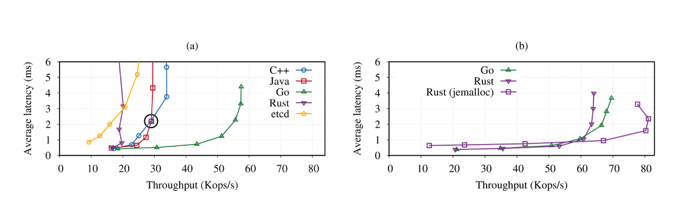


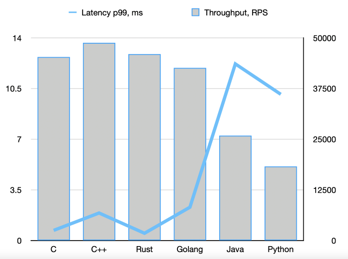

исследование:
https://arxiv.org/html/2405.11182v1
https://nuancesprog.ru/p/14464/

> Фокус на безопасности - как решение проблем C и C++

Иммутабельность переменных по умолчанию, новая парадигма работы с памятью: borrowing и ownership. Решение Race Condition, Memory leaks, dangling pointers, buffer overflows, double free memory.

# Установка Rust

Скачивал Rust на Arch официально рекомендуемым способом - через менеджер обновлений rustup.

(Гайд: https://wiki.archlinux.org/title/Rust_(%D0%A0%D1%83%D1%81%D1%81%D0%BA%D0%B8%D0%B9))

    Компилятор Rust (rustc) : 
        Основной компилятор Rust, который преобразует ваш код на Rust в машинный код.
         

    Cargo : 
        Система сборки и управление зависимостями для Rust-проектов.
        Позволяет создавать проекты, управлять зависимостями из crates.io, компилировать и запускать программы.
         

    Standard Library : 
        Стандартная библиотека Rust, которая предоставляет базовые типы данных, коллекции, потоки, I/O и другие функциональные возможности.
         

    Rust Source Code  (при необходимости): 
        Источники стандартной библиотеки Rust, которые могут быть полезны для отладки или расширения.
         

    Документация  (опционально): 
        Локальная копия документации Rust, включая The Book, API справочник и другие ресурсы.
         

    Дополнительные компоненты : 
        Например, RLS (Rust Language Server) для поддержки IDE, rust-analyzer, Clippy (анализатор кода), Miri (инструмент для проверки безопасности памяти) и другие инструменты.

### LLVM

Rust через rustup автоматически скачивает предварительно скомпилированную версию LLVM, которая используется для компиляции кода.

### Какие зависимости требуются для работы Rust? 

1. LLVM : 

    Rust использует LLVM как backend для генерации машинного кода.
     

2. C++ Standard Library : 

    Для некоторых платформ (например, Linux) требуется C++ стандартная библиотека (обычно libstdc++ или libc++), так как Rust использует её для некоторых низкоуровневых операций.
     

3. Системные зависимости : 

    На разных системах могут потребоваться дополнительные пакеты для успешной работы Rust. Например:
        Linux : build-essential, clang, cmake, pkg-config.
        macOS : Xcode Command Line Tools (xcode-select --install).
        Windows : MSVC или MinGW (в зависимости от выбранного компилятора).
         
     

4. Для некоторых задач могут потребоваться дополнительные инструменты : 

    Если вы работаете с FFI (Foreign Function Interface) или вызываете системные API, может потребоваться установка соответствующих заголовочных файлов и библиотек.
     

>Для дебаггинга В VScode потребуется CodeLLDB

### Обновление до новой версии Rust:

`rustup update`

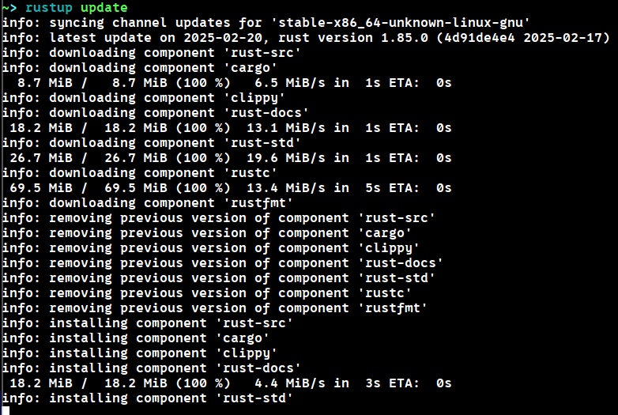

# Начало работы как я создал этот проект

Команда

`cargo new whyrust_250223`

Cоздаёт и инициализирует проект вместе с cargo.toml - конфигурационным файлом с зависимостями и описанием как менеджер cargo будет билдить и запускать проект.

    my_project/
    ├── Cargo.toml
    ├── src/
    │   └── main.rs
    └── .gitignore
         

Команда

`cargo init`

Инициализирует аналогичную схему в уже созданной директории

Но если директории не существует, то команды 

`cargo new <projectname>`

и

`cargo init <projectname>`

Будут аналогичны

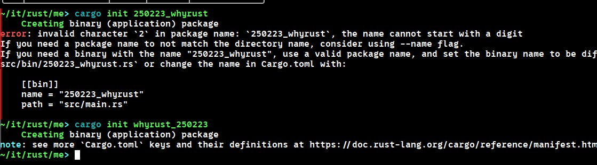

Минимум ручной работы.

# Переменные и иммутабельность

По умолчанию в Расте переменные иммутабельны и чтобы сказать что переменная изменяется, нужно это указать явно

```Rust
fn main() {
    let mut x = 5;
    println!("The value of x is: {x}");
    x = 6;
    println!("The value of x is: {x}");
}
```

### Константы.

```Rust
const THREE_HOURS_IN_SECONDS: u32 = 60 * 60 * 3;
```

Внимание на нейминг.

Отличие иммутабельных переменных от контсант - константы определяются во врея компиляции и им не могут быть присвоены переменные (строго литералы или статические выражения), а переменные в результате выполнения.

### Shadowing (как я называю "затенение")

Посмотрим на любопытный код:

```Rust
fn main() {
    let x = 5;

    let x = x + 1;

    {
        let x = x * 2;
        println!("The value of x in the inner scope is: {x}");
    }

    println!("The value of x is: {x}");
}
```

Выведет:
```Shell
$ cargo run
   Compiling variables v0.1.0 (file:///projects/variables)
    Finished `dev` profile [unoptimized + debuginfo] target(s) in 0.31s
     Running `target/debug/variables`
The value of x in the inner scope is: 12
The value of x is: 6
```

Так можно

```Rust
    let spaces = "   ";
    let spaces = spaces.len();
```

А так нельзя:

```Rust
    let mut spaces = "   ";
    spaces = spaces.len();
```

```Shell
$ cargo run
   Compiling variables v0.1.0 (file:///projects/variables)
error[E0308]: mismatched types
 --> src/main.rs:3:14
  |
2 |     let mut spaces = "   ";
  |                      ----- expected due to this value
3 |     spaces = spaces.len();
  |              ^^^^^^^^^^^^ expected `&str`, found `usize`

For more information about this error, try `rustc --explain E0308`.
error: could not compile `variables` (bin "variables") due to 1 previous error
```

# Типы данных

Питоньи фокусы не прокатят

Такое не скомпилируется:

```Rust
let guess = "42".parse().expect("Not a number!");
```

```Shell
$ cargo build
   Compiling no_type_annotations v0.1.0 (file:///projects/no_type_annotations)
error[E0284]: type annotations needed
 --> src/main.rs:2:9
  |
2 |     let guess = "42".parse().expect("Not a number!");
  |         ^^^^^        ----- type must be known at this point
  |
  = note: cannot satisfy `<_ as FromStr>::Err == _`
help: consider giving `guess` an explicit type
  |
2 |     let guess: /* Type */ = "42".parse().expect("Not a number!");
  |              ++++++++++++

For more information about this error, try `rustc --explain E0284`.
error: could not compile `no_type_annotations` (bin "no_type_annotations") due to 1 previous error
```

Rust статически типизированный, ему надо понимать, что мы хотим записать в guess.

```Rust
let guess: u32 = "42".parse().expect("Not a number!");
```

*Кстати expect - это что то вроде исключений, что меня тоже зацепило лаконичностью или как в Go 

```Go
if err != nil {}
```

Но в Rust. То есть при выполнении функции 

`.parse()`

Она ожидает что мы будем делать на случай если что-то пойдёт не так

### Типы:

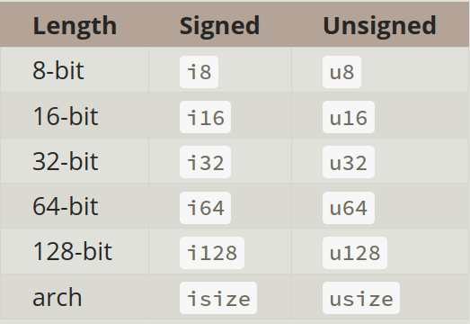

Arch - архитектура (x32 или x64 итд, хм, а может даже и x128)

Кстати, насчёт выхода за границы - если мы тестируем в режиме debug (по умолчанию при cargo run) то при выходе за границы диапазона - вылезет ошибка.

Если в режиме "--release", то он просто циклично посчитает с конца в начало (что-то вроде 127 + 2 = -126) 

Как это ловить в релизной версии сказано тут

https://doc.rust-lang.org/book/ch03-02-data-types.html#integer-overflow

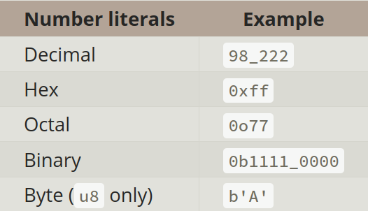

#### Float

Так же числа с плавающей точкой

f32, f64.

в соответствии с IEEE-754 standard.

Операции:

```Rust
fn main() {
    // addition
    let sum = 5 + 10;

    // subtraction
    let difference = 95.5 - 4.3;

    // multiplication
    let product = 4 * 30;

    // division
    let quotient = 56.7 / 32.2;
    let truncated = -5 / 3; // Results in -1

    // remainder
    let remainder = 43 % 5;
}
```

#### char

```Rust
fn main() {
    let c = 'z';
    let z: char = 'ℤ'; // with explicit type annotation
    let heart_eyed_cat = '😻';
}
```

По умолчанию char 4 байта.

Подробнее про строки:

https://doc.rust-lang.org/book/ch08-02-strings.html#storing-utf-8-encoded-text-with-strings

#### Tuple

```Rust
fn main() {
    let tup = (500, 6.4, 1);

    let (x, y, z) = tup;

    println!("The value of y is: {y}");
}
```

#### Array (не путать с векторами!)

>NOTE!

Размер Array определяется на этапе компиляции. И задать размер как переменную невозможно! Для этого созданы вектора, когда размер нам заранее неизвестен.!

```Rust
fn main() {
    let months = ["January", "February", "March", "April", "May", "June", "July",
              "August", "September", "October", "November", "December"];
    let first = a[0];
    let second = a[1];
}
```

```Rust
fn main() {
    let a: [i32; 5] = [1, 2, 3, 4, 5];
}
```

```Rust
fn main() {
    let a: [i32; 5] = [1, 2, 3, 4, 5];
}
```

Проинициализирует пять троек:

```Rust
fn main() {
    let a = [3; 5];
}
```

Выход за пределы массива в таком коде выдадут ошибку даже в режиме --release

```Rust
use std::io;

fn main() {
    let a: [i8; 5] = [1, 2, 3, 4, 5];

    println!("Please enter an array index.");

    let mut index = String::new();

    io::stdin()
        .read_line(&mut index)
        .expect("Failed to read line");

    let index: usize = index
        .trim()
        .parse()
        .expect("Index entered was not a number");

    let element = a[index] + 127;

    println!("The value of the element at index {index} is: {element}");
}
```

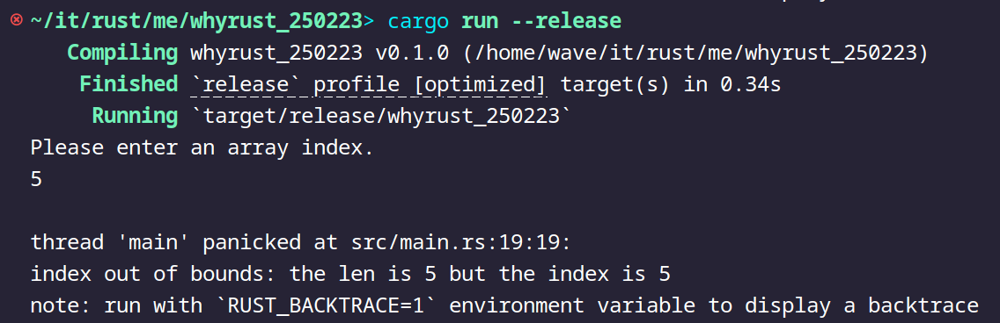

# Функции

```Rust
fn main() {
    another_function(5);
}

fn another_function(x: i32) {
    println!("The value of x is: {x}");
}
```
Прошу обратить внимание
snake_case.

## Statements and Expressions

внутри statement находится expression (выражение)
То есть выражение внутри. А statement как обёртка над выражением.

В то же время мы не может присвоить statement statement'у.

Не скомпилируется:

```Rust
fn main() {
    let x = let y = 6;
}
```

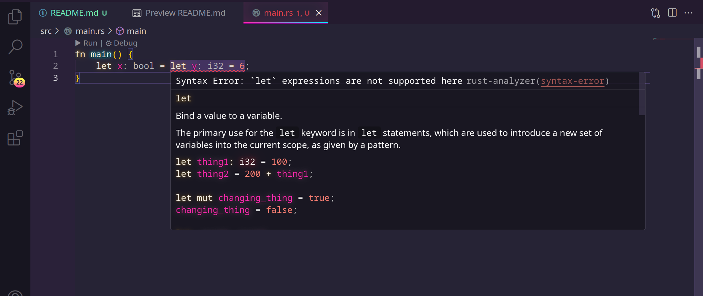

А такое скомпилируется, поскольку statement let y = ... закрылся выражением;, а не другим statement.

```Rust
fn main() {
    let y = {
        let x = 3;
        x + 1
    };

    println!("The value of y is: {y}");
}
```

## Return values

Скомпилируется, мы опускаем return:

Кстати внимание на сигнатуру возвращаемого значения.

```Rust
fn five() -> i32 {
    5
}

fn main() {
    let x = five();

    println!("The value of x is: {x}");
}
```

Прелесть!

А теперь внимание! Квиз!

Какой из этих двух скомпилируется, а какой нет?

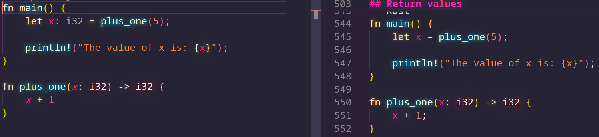

Number One

```Rust
fn main() {
    let x = plus_one(5);

    println!("The value of x is: {x}");
}

fn plus_one(x: i32) -> i32 {
    x + 1
}
```

Number Two

```Rust
fn main() {
    let x = plus_one(5);

    println!("The value of x is: {x}");
}

fn plus_one(x: i32) -> i32 {
    x + 1;
}
```

```Shell
$ cargo run
   Compiling functions v0.1.0 (file:///projects/functions)
error[E0308]: mismatched types
 --> src/main.rs:7:24
  |
7 | fn plus_one(x: i32) -> i32 {
  |    --------            ^^^ expected `i32`, found `()`
  |    |
  |    implicitly returns `()` as its body has no tail or `return` expression
8 |     x + 1;
  |          - help: remove this semicolon to return this value

For more information about this error, try `rustc --explain E0308`.
error: could not compile `functions` (bin "functions") due to 1 previous error
```

# Control flow if statements

Отвыкаем от излишней свободы в Си

Не скомпилируется. Поскольку ожидает ЯВНО bool.

```Rust
fn main() {
    let number = 3;

    if number {
        println!("number was three");
    }
}
```

```Shell
$ cargo run
   Compiling branches v0.1.0 (file:///projects/branches)
error[E0308]: mismatched types
 --> src/main.rs:4:8
  |
4 |     if number {
  |        ^^^^^^ expected `bool`, found integer

For more information about this error, try `rustc --explain E0308`.
error: could not compile `branches` (bin "branches") due to 1 previous error
```

```Rust
fn main() {
    let number = 3;

    if number {
        println!("number was three");
    }
}
```

*Не обращайте внимания на 

`0 != number`

*Это не рекомендации так писать в Rust, а лично мои. Мозгу проще воспринимать сначала литерал а потом то, с чем идёт сравнение, чем держать в памяти сначала абстрактный number а потом сравнивать с нулём. Это действует доли секунды, да, но немного помогает. 

```Rust
fn main() {
    let number = 3;

    if 0 != number {
        println!("number was three");
    }
}
```

#### else if

```Rust
fn main() {
    let number = 6;

    if number % 4 == 0 {
        println!("number is divisible by 4");
    } else if number % 3 == 0 {
        println!("number is divisible by 3");
    } else if number % 2 == 0 {
        println!("number is divisible by 2");
    } else {
        println!("number is not divisible by 4, 3, or 2");
    }
}
```

#### Вместо тернарного оператора

```Rust
fn main() {
    let condition = true;
    let number = if condition { 5 } else { 6 };

    println!("The value of number is: {number}");
}
```

Не скомпилируется

```Rust
fn main() {
    let condition = true;

    let number = if condition { 5 } else { "six" };

    println!("The value of number is: {number}");
}
```

```Shell
$ cargo run
   Compiling branches v0.1.0 (file:///projects/branches)
error[E0308]: `if` and `else` have incompatible types
 --> src/main.rs:4:44
  |
4 |     let number = if condition { 5 } else { "six" };
  |                                 -          ^^^^^ expected integer, found `&str`
  |                                 |
  |                                 expected because of this

For more information about this error, try `rustc --explain E0308`.
error: could not compile `branches` (bin "branches") due to 1 previous error
```

# Циклы

Тут уже ничего особенного, поэтому долго не задержимся

```Rust
fn main() {
    loop {
        println!("again!");
    }
}
```

*Мне больше по душе конечно цикл у Go - любой цикл можно через оператор for реализовать.

Тут видимо всё же хотят разграничить 

>loop - без условий, 

>while - с одним условием

>for - перебирает коллекции либо с тремя классическими

Можно и такие фокусы. break тут как return работает.

```Rust
fn main() {
    let mut counter = 0;

    let result = loop {
        counter += 1;

        if counter == 10 {
            break counter * 2;
        }
    };

    println!("The result is {result}");
}
```

## Labels (для break)

```Rust
#![allow(unreachable_code, unused_labels)]

fn main() {
    'outer: loop {
        println!("Entered the outer loop");

        'inner: loop {
            println!("Entered the inner loop");

            // This would break only the inner loop
            //break;

            // This breaks the outer loop
            break 'outer;
        }

        println!("This point will never be reached");
    }

    println!("Exited the outer loop");
}
```

## while

```Rust
fn main() {
    // A counter variable
    let mut n = 1;

    // Loop while `n` is less than 101
    while n < 101 {
        if n % 15 == 0 {
            println!("fizzbuzz");
        } else if n % 3 == 0 {
            println!("fizz");
        } else if n % 5 == 0 {
            println!("buzz");
        } else {
            println!("{}", n);
        }

        // Increment counter
        n += 1;
    }
}
```

## for

```Rust
fn main() {
    let a = [10, 20, 30, 40, 50];

    for element in a {
        println!("the value is: {element}");
    }
}
```

>rev() - значит reverse

```Rust
fn main() {
    for number in (1..4).rev() {
        println!("{number}!");
    }
    println!("LIFTOFF!!!");
}
```

если хотим итерироваться через кастомное значение, то используем 

`.step_by(2)`

```Rust
fn main() {
    for number in (1..4).rev().step_by(2) {
        println!("{number}!");
    }
    println!("LIFTOFF!!!");
}
```

```Rust
fn main() {
    // `n` will take the values: 1, 2, ..., 100 in each iteration
    for n in 1..=100 {
        if n % 15 == 0 {
            println!("fizzbuzz");
        } else if n % 3 == 0 {
            println!("fizz");
        } else if n % 5 == 0 {
            println!("buzz");
        } else {
            println!("{}", n);
        }
    }
}
```

>Немного забежали вперёд, тут из нового вектор из стрингов, итератор, синтаксический сахар: match, который убирает нагромождения из if else операторов.

```Rust
fn main() {
    let names = vec!["Bob", "Frank", "Ferris"];

    for name in names.iter() {
        match name {
            &"Ferris" => println!("There is a rustacean among us!"),
            // TODO ^ Try deleting the & and matching just "Ferris"
            _ => println!("Hello {}", name),
        }
    }
    
    println!("names: {:?}", names);
}
```

# Работа с памятью ownership и borrowing

>Вот мы и добрались до самого интересного, как Rust'у удалось решить проблему memory leaks (утечки памяти), dangling pointers (висячие указатели) без использования garbage collector (сборщик мусора), что позволяет быть равным по производительности C/C++, а где то даже и быстрее. Этот раздел я бы назвал важнейшим, ведь он и рассказывает о главных особенностях Rust...

Если в кратце - две концепции которые автоматизируют выделение/освобождение памяти как в C/C++ и не требуют для этого сборщик мусора в рантайме, который замедляет работу.

Если подробнее:

Правила владения

Сначала давайте рассмотрим правила владения:

    - У каждого значения в Rust есть владелец
    - В каждый момент времени может быть только один владелец
    - Когда владелец выходит из области действия, значение будет сброшено

Область действия (всё тоже самое что и в других ЯП):

Пример со строковым литералом, строго закодированном на этапе компиляции

```Rust
{                       // s is not valid here, it’s not yet declared
    let s = "hello";    // s is valid from this point forward
                        // do stuff with s but not mutating
}                       // this scope is now over, and s is no longer valid

```

Выделение string в куче. Если хотим менять

Память автоматически возвращается, как только переменная, которой она принадлежит, выходит из области видимости.

```Rust
{
    let s = String::from("hello");
    s.push_str(", world!"); // push_str() appends a literal to a String
    println!("{s}"); // This will print `hello, world!`
}
```

Когда она выходит из области видимости Rust вызывает деструктор drop автоматически.

https://doc.rust-lang.org/std/ops/trait.Drop.html#tymethod.drop

В C++ этот шаблон освобождения ресурсов в конце жизненного цикла элемента иногда называется Resource Acquisition Is Initialization (RAII)


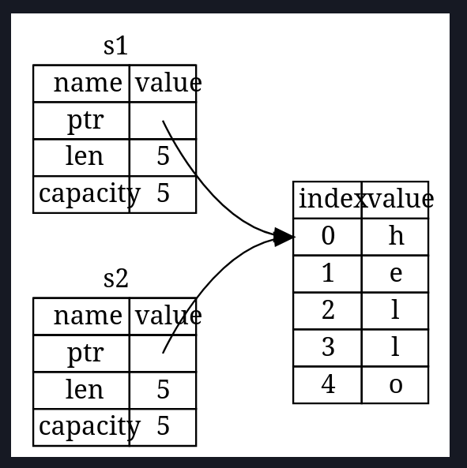

>Важно! Чтобы не было двойного освобождения, Rust сделает s1 недействительной! Это сделано, чтобы уйти от проблемы двойного освобождения. 

Не скомпилируется:

```Rust
fn main() {
    let s1 = String::from("hello");
    let s2 = s1;

    println!("{s1}, world!");
}
```

```Shell
$ cargo run
   Compiling ownership v0.1.0 (file:///projects/ownership)
error[E0382]: borrow of moved value: `s1`
 --> src/main.rs:5:15
  |
2 |     let s1 = String::from("hello");
  |         -- move occurs because `s1` has type `String`, which does not implement the `Copy` trait
3 |     let s2 = s1;
  |              -- value moved here
4 |
5 |     println!("{s1}, world!");
  |               ^^^^ value borrowed here after move
  |
  = note: this error originates in the macro `$crate::format_args_nl` which comes from the expansion of the macro `println` (in Nightly builds, run with -Z macro-backtrace for more info)
help: consider cloning the value if the performance cost is acceptable
  |
3 |     let s2 = s1.clone();
  |                ++++++++

For more information about this error, try `rustc --explain E0382`.
error: could not compile `ownership` (bin "ownership") due to 1 previous error
```

> Другой пример тоже сработает. 
> Здесь область памяти выделенная под "hello" освободится после того 
> как на неё перестанет что-либо ссылаться. drop() вызовется сразу (immediately).

```Rust
fn main() { 
    let mut s = String::from("hello");
    s = String::from("ahoy");
    println!("{s}, world!");
}
```

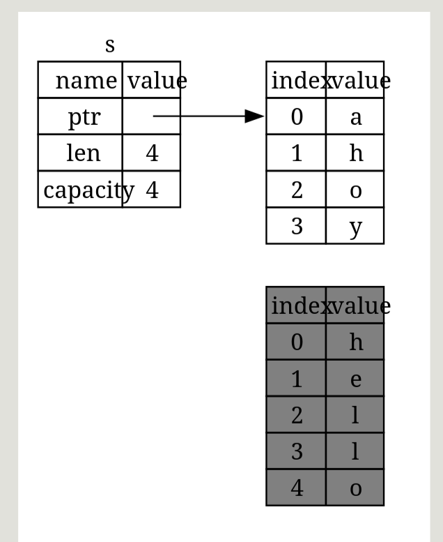

>Глубокое копирование.

```Rust
fn main() { 
    let s1 = String::from("hello");
    let s2 = s1.clone();
    println!("s1 = {s1}, s2 = {s2}");
}
```

>Здесь данные копируются на стеке. И не происходит ссылка. При изменении y не поменяется x.

```Rust
fn main() { 
    let x = 5;
    let y = x;

    println!("x = {x}, y = {y}");
}
```

Причина в том, что такие типы, как целые числа, имеющие известный размер во время компиляции, 
хранятся полностью в стеке, поэтому копии фактических значений создаются быстро. 
Это означает, что нет причин, по которым мы хотели бы предотвратить 
x 
недействительность после создания переменной y. 
Другими словами, здесь нет разницы между глубоким и поверхностным копированием, 
поэтому вызов cloneне будет делать ничего, отличного от обычного поверхностного копирования, 
и мы можем его пропустить.

## Ownership (владение)

Пример того как передаётся право собственности и как это работает с простейшими литералами.

```Rust
fn main() {
    let s = String::from("hello");  // s comes into scope

    takes_ownership(s);             // s's value moves into the function...
                                    // ... and so is no longer valid here

    let x = 5;                      // x comes into scope

    makes_copy(x);                  // because i32 implements the Copy trait,
                                    // x does NOT move into the function,
    println!("{}", x);              // so it's okay to use x afterward

} // Here, x goes out of scope, then s. But because s's value was moved, nothing
  // special happens.

fn takes_ownership(some_string: String) { // some_string comes into scope
    println!("{some_string}");
} // Here, some_string goes out of scope and `drop` is called. The backing
  // memory is freed.

fn makes_copy(some_integer: i32) { // some_integer comes into scope
    println!("{some_integer}");
} // Here, some_integer goes out of scope. Nothing special happens.
```

>Пример передачи владения и взятия обратно

```Rust
fn main() {
    let s1 = gives_ownership();         // gives_ownership moves its return
                                        // value into s1

    let s2 = String::from("hello");     // s2 comes into scope

    let s3 = takes_and_gives_back(s2);  // s2 is moved into
                                        // takes_and_gives_back, which also
                                        // moves its return value into s3
} // Here, s3 goes out of scope and is dropped. s2 was moved, so nothing
  // happens. s1 goes out of scope and is dropped.

fn gives_ownership() -> String {             // gives_ownership will move its
                                             // return value into the function
                                             // that calls it

    let some_string = String::from("yours"); // some_string comes into scope

    some_string                              // some_string is returned and
                                             // moves out to the calling
                                             // function
}

// This function takes a String and returns one
fn takes_and_gives_back(a_string: String) -> String { // a_string comes into
                                                      // scope

    a_string  // a_string is returned and moves out to the calling function
}
```

>Пример возвращений (и передачи владения обратно) кортежом

```Rust
fn main() {
    let s1 = String::from("hello");

    let (s2, len) = calculate_length(s1);

    println!("The length of '{s2}' is {len}.");
}

fn calculate_length(s: String) -> (String, usize) {
    let length = s.len(); // len() returns the length of a String

    (s, length)
}
```


>Пример с циклом когда данные удаляются. Демонстрация работы ownership.

```Rust
fn main() {
    let names = vec!["Bob", "Frank", "Ferris"];

    for name in names.into_iter() {
        match name {
            "Ferris" => println!("There is a rustacean among us!"),
            _ => println!("Hello {}", name),
        }
    }
    
    println!("names: {:?}", names);
    // FIXME ^ Comment out this line
}
```

## Borrowing (заимствование)

А теперь borrowing. Основная концепция взятия в аренду на примере картины "Моны Лизы", 
Давайте лучше называть это заимствованием.  

Только при мутабельном заимствовании  (&mut T) возникает ситуация, где владелец теряет доступ к ресурсу, как если бы картину действительно украли.

    В Rust есть строгие правила заимствования:
        Вы можете иметь либо несколько неизменяемых ссылок, либо одну мутабельную ссылку.
         
    В контексте аналогии: музей может позволить многим людям одновременно смотреть на картину (неизменяемые ссылки), но если кто-то хочет её изменить (мутабельное заимствование), все остальные должны подождать.
     
Представьте, что музей владеет картиной Моны Лизы: 

    Неизменяемое заимствование (&T):  
        Несколько людей могут одновременно смотреть на картину в музее.
        Это безопасно, потому что никто не может её изменить.
         

    Мутабельное заимствование (&mut T):  
        Один человек забирает картину для реставрации.
        Пока он её держит, никто другой не может взаимодействовать с оригиналом (ни смотреть, ни реставрировать).
         

    Возвращение картины:  
        Как только реставратор возвращает картину музею, владелец снова может ею распорядиться.
         

    Клонирование (clone):  
        Если кто-то делает копию картины, это уже не оригинал. Теперь у нас есть два независимых объекта: оригинал в музее и копия у другого человека.

Тобишь гарантии. Это предотвращает проблему Race Condition в многопоточности.

Но давайте рассмотрим примеры в однопоточном режиме для понимания.


```Rust
fn main() {
    let mona_lisa = String::from("Retired Mona Lisa"); // Музей владеет картиной

    {
        let borrowed1 = &mona_lisa; // Неизменяемое заимствование: несколько человек могут смотреть
        let borrowed2 = &mona_lisa; // Неизменяемое заимствование: несколько человек могут смотреть
        println!("Looking at: {}{}", borrowed1, borrowed2);
    } // Заимствование завершено, владелец снова может использовать ресурс

    {
        let restorer = &mut mona_lisa; // Мутабельное заимствование: реставратор берёт картину
        *restorer = String::from("Restored Mona Lisa"); // Реставрация
    } // После реставрации реставратор автоматически перестаёт владеть картиной.

    println!("Final version: {}", mona_lisa); // Владелец снова может использовать ресурс
}
```

>(я специально оставил код с ошибкой, чтобы была возможность интерактивно показать работу с компиляцией)
        


Не скомпилируется

```Rust
fn main() {
    let mut s = String::from("hello");

    let r1 = &s; // no problem
    let r2 = &s; // no problem
    let r3 = &mut s; // BIG PROBLEM

    println!("{}, {}, and {}", r1, r2, r3);
}
```

```Shell
$ cargo run
   Compiling ownership v0.1.0 (file:///projects/ownership)
error[E0502]: cannot borrow `s` as mutable because it is also borrowed as immutable
 --> src/main.rs:6:14
  |
4 |     let r1 = &s; // no problem
  |              -- immutable borrow occurs here
5 |     let r2 = &s; // no problem
6 |     let r3 = &mut s; // BIG PROBLEM
  |              ^^^^^^ mutable borrow occurs here
7 |
8 |     println!("{}, {}, and {}", r1, r2, r3);
  |                                -- immutable borrow later used here

For more information about this error, try `rustc --explain E0502`.
error: could not compile `ownership` (bin "ownership") due to 1 previous error
```


```Rust
fn main() {
    let mut s = String::from("hello");

    let r1 = &s; // no problem
    let r2 = &s; // no problem
    println!("{r1} and {r2}");
    // variables r1 and r2 will not be used after this point

    let r3 = &mut s; // no problem
    println!("{r3}");
}
```

>Rust без висячих указателей

Не скомпилируется

```Rust
fn main() {
    let reference_to_nothing = dangle();
}

fn dangle() -> &String {
    let s = String::from("hello");

    &s
}
```

>Пример когда данные сохраняются, работа ссылки. Работа borrowing

```Rust
fn main() {
    let mut names = vec!["Bob", "Frank", "Ferris"];

    for name in names.iter_mut() {
        *name = match name {
            &mut "Ferris" => "There is a rustacean among us!",
            _ => "Hello",
        }
    }

    println!("names: {:?}", names);
}
```

# Structs

```Rust
struct User {
    active: bool,
    username: String,
    email: String,
    sign_in_count: u64,
}
```

>Пример инициализации (можно улучшить своим конструктором, билдером) а так же сокращения.

```Rust
fn main() {
    let user1 = User {
        active: true,
        username: String::from("someusername123"),
        email: String::from("someone@example.com"),
        sign_in_count: 1,
    };
    let user2 = User {
        email: String::from("another@example.com"),
        ..user1
    };
}
```

>Пример билдера

```Rust
fn build_user(email: String, username: String) -> User {
    User {
        active: true,
        username: username,
        email: email,
        sign_in_count: 1,
    }
}
```

>Верхнее можно сократить

```Rust
fn build_user(email: String, username: String) -> User {
    User {
        active: true,
        username,
        email,
        sign_in_count: 1,
    }
}
```

Когда можно обойтись кортежами

```Rust
struct Color(i32, i32, i32);
struct Point(i32, i32, i32);

fn main() {
    let black = Color(0, 0, 0);
    let origin = Point(0, 0, 0);
}
```


<!-- Право собственности на данные Struct

В Userопределении структуры в листинге 5-1 мы использовали Stringтип owned вместо &strтипа string slice. Это преднамеренный выбор, поскольку мы хотим, чтобы каждый экземпляр этой структуры владел всеми своими данными и чтобы эти данные были действительными до тех пор, пока действительна вся структура.

Структуры также могут хранить ссылки на данные, принадлежащие чему-то другому, но для этого требуется использование времени жизни — функции Rust, которую мы обсудим в Главе 10. Время жизни гарантирует, что данные, на которые ссылается структура, будут действительными до тех пор, пока существует структура. Допустим, вы пытаетесь сохранить ссылку в структуре без указания времени жизни, как в следующем примере; это не сработает:

```Rust
struct User {
    active: bool,
    username: &str,
    email: &str,
    sign_in_count: u64,
}

fn main() {
    let user1 = User {
        active: true,
        username: "someusername123",
        email: "someone@example.com",
        sign_in_count: 1,
    };
}
``` -->

>Если хотим просмотреть структуру через принт. Просто введём внешний атрибут. 

```Rust
#[derive(Debug)]
struct Rectangle {
    width: u32,
    height: u32,
}

fn main() {
    let rect1 = Rectangle {
        width: 30,
        height: 50,
    };

    println!("rect1 is {rect1:#?}");
}
```

> Использование dbg!()

```Rust
#[derive(Debug)]
struct Rectangle {
    width: u32,
    height: u32,
}

fn main() {
    let scale = 2;
    let rect1 = Rectangle {
        width: dbg!(30 * scale),
        height: 50,
    };

    dbg!(&rect1);
}
```

## Method

>Мы можем выбрать, чтобы дать методу то же имя, что и одно из полей структуры

```Rust
#[derive(Debug)]
struct Rectangle {
    width: u32,
    height: u32,
}

impl Rectangle {
    fn area(&self) -> u32 {
        self.width * self.height
    }
    fn width(&self) -> bool {
        self.width > 0
    }
}

fn main() {
    let rect1 = Rectangle {
        width: 30,
        height: 50,
    };

    println!(
        "The area of the rectangle is {} square pixels.",
        rect1.area()
    );
}
```

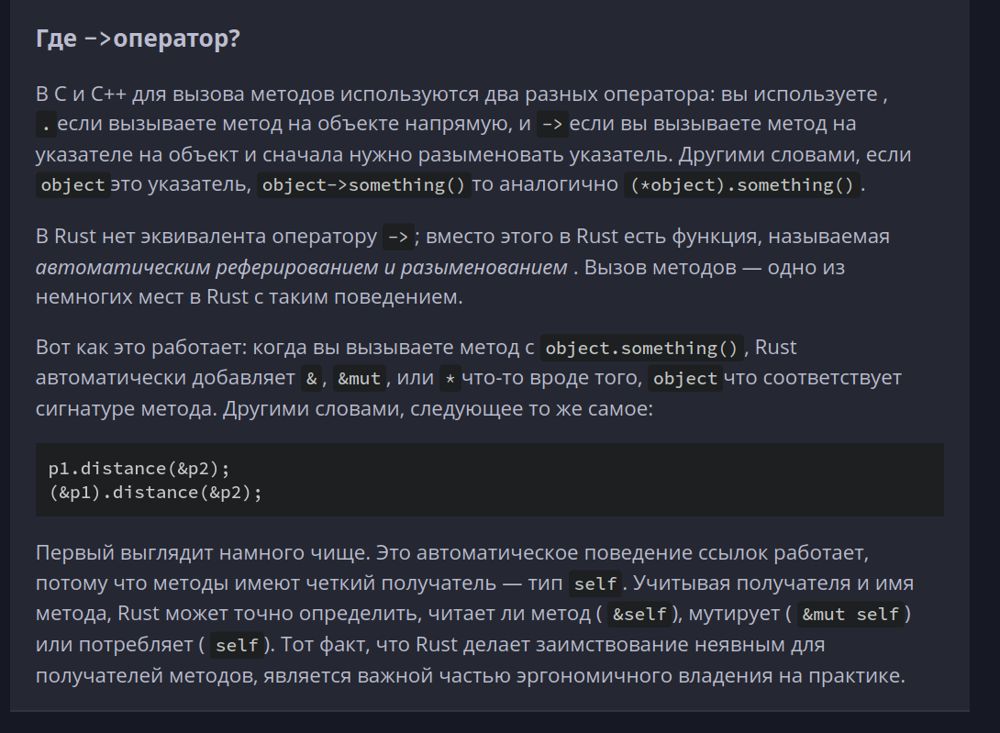

# enums

```Rust
enum IpAddrKind {
    V4,
    V6,
}
/*
enum IpAddr {
    V4(String),
    V6(String),
}
enum IpAddr {
    V4(u8, u8, u8, u8),
    V6(String),
}
enum Message {
    Quit,
    Move { x: i32, y: i32 },
    Write(String),
    ChangeColor(i32, i32, i32),
}
*/
struct IpAddr {
    kind: IpAddrKind,
    address: String,
}

let home = IpAddr {
    kind: IpAddrKind::V4,
    address: String::from("127.0.0.1"),
};

let loopback = IpAddr {
    kind: IpAddrKind::V6,
    address: String::from("::1"),
};
```

Как в библиотеке организована работа с IpV4, IpV6.

https://doc.rust-lang.org/std/net/enum.IpAddr.html

## Null

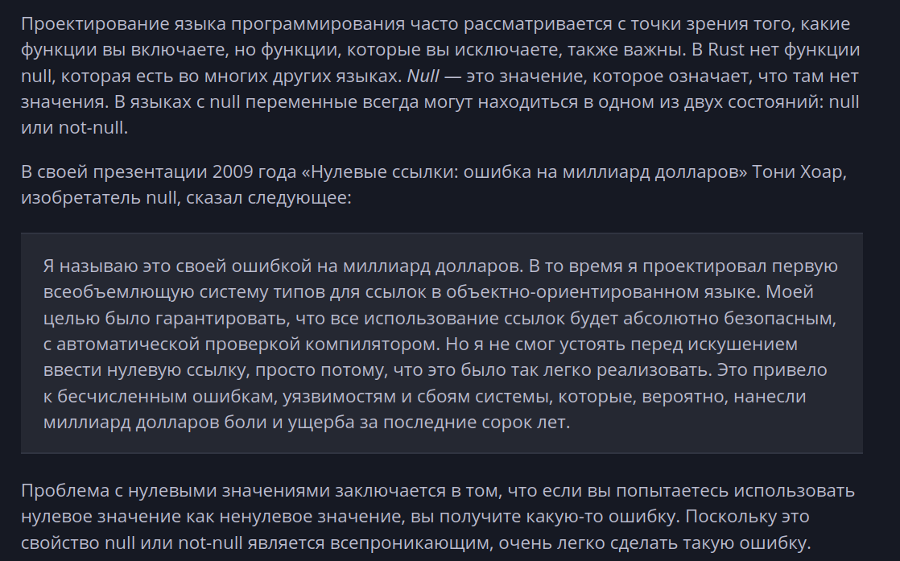

## Option

```Rust
enum Option<T> {
    None,
    Some(T),
}
```

<T> - это generic. Пока углубляться не буду

>Не скомпилируется:

```Rust
fn main() {
    let x: i8 = 5;
    let y: Option<i8> = Some(5);

    let sum = x + y;
}
```

need impl

```Shell
$ cargo run
   Compiling enums v0.1.0 (file:///projects/enums)
error[E0277]: cannot add `Option<i8>` to `i8`
 --> src/main.rs:5:17
  |
5 |     let sum = x + y;
  |                 ^ no implementation for `i8 + Option<i8>`
  |
  = help: the trait `Add<Option<i8>>` is not implemented for `i8`
  = help: the following other types implement trait `Add<Rhs>`:
            `&'a i8` implements `Add<i8>`
            `&i8` implements `Add<&i8>`
            `i8` implements `Add<&i8>`
            `i8` implements `Add`

For more information about this error, try `rustc --explain E0277`.
error: could not compile `enums` (bin "enums") due to 1 previous error
```

Подробнее об Option:

https://doc.rust-lang.org/std/option/enum.Option.html

Подробнее как их складывать в следующем разделе:

# match null и использование Option Result

Включены в прелюдию.  
https://doc.rust-lang.org/std/prelude/index.html

>Spoiler к предыдущему:

```Rust
fn main() {
    let x: Option<i8> = Some(5);
    let y: Option<i8> = Some(5);

    let sum = match (x, y) {
        (Some(a), Some(b)) => Some(a + b), // Если оба значения есть, складываем их
        _ => None,                       // В остальных случаях возвращаем None
    };

    println!("{:?}", sum); // Выводит: Some(10)

    /*    
    let x: Option<i8> = Some(5);
    let y: Option<i8> = Some(5);

    if let (Some(a), Some(b)) = (x, y) {
        println!("Sum: {}", a + b); // Выводит: Sum: 10
    } else {
        println!("One of the values is None");
    }
    */
    // unwrap() !Важно!:  Если хотя бы одно из значений будет None, программа вызовет panic!.
    /*
    let x: Option<i8> = Some(5);
    let y: Option<i8> = Some(5);

    let sum = x.unwrap() + y.unwrap(); // Просто извлекаем значения

    println!("Sum: {}", sum); // Выводит: Sum: 10
    */
    // или ещё можно .unwrap_or(<туть значение по умолчанию по типу, если внезапно null>):
}
```

## match

```Rust
enum Coin {
    Penny,
    Nickel,
    Dime,
    Quarter,
}

fn value_in_cents(coin: Coin) -> u8 {
    match coin {
        Coin::Penny => {
            println!("Lucky penny!");
            1
        },
        Coin::Nickel => 5,
        Coin::Dime => 10,
        Coin::Quarter => 25,
    }
}
```

>из предыдущего раздела:

```Rust
fn plus_one(x: Option<i32>) -> Option<i32> {
    match x {
        None => None,
        Some(i) => Some(i + 1),
    }
}

let five = Some(5);
let six = plus_one(five);
let none = plus_one(None);
```

>Не скомпилируется

```Rust
fn plus_one(x: Option<i32>) -> Option<i32> {
    match x {
        Some(i) => Some(i + 1),
        /*
        other => move_player(other),
        _ => (),
        */
    }
}
```

```Shell
$ cargo run
   Compiling enums v0.1.0 (file:///projects/enums)
error[E0004]: non-exhaustive patterns: `None` not covered
   --> src/main.rs:3:15
    |
3   |         match x {
    |               ^ pattern `None` not covered
    |
note: `Option<i32>` defined here
   --> file:///home/.rustup/toolchains/1.82/lib/rustlib/src/rust/library/core/src/option.rs:571:1
    |
571 | pub enum Option<T> {
    | ^^^^^^^^^^^^^^^^^^
...
575 |     None,
    |     ---- not covered
    = note: the matched value is of type `Option<i32>`
help: ensure that all possible cases are being handled by adding a match arm with a wildcard pattern or an explicit pattern as shown
    |
4   ~             Some(i) => Some(i + 1),
5   ~             None => todo!(),
    |

For more information about this error, try `rustc --explain E0004`.
error: could not compile `enums` (bin "enums") due to 1 previous error
```

## if let

>Следующие два идентичны

```Rust
let config_max = Some(3u8);
match config_max {
    Some(max) => println!("The maximum is configured to be {max}"),
    _ => (),
}
```

```Rust
let config_max = Some(3u8);
if let Some(max) = config_max {
    println!("The maximum is configured to be {max}");
}
```

> по желанию после if let можно добавить else


## Slice (срезы)

Так же как и в питоне, в Rust есть срезы. Долго не задержимся, просто покажу общий синтаксис.

```Rust
fn main() {
    let s = String::from("hello world");

    let hello = &s[0..5];
    let world = &s[6..11];

    let len = s.len();

    // equal
    let slice = &s[3..len];
    let slice = &s[3..];

    // also equal
    let slice = &s[0..len];
    let slice = &s[..];

}
```

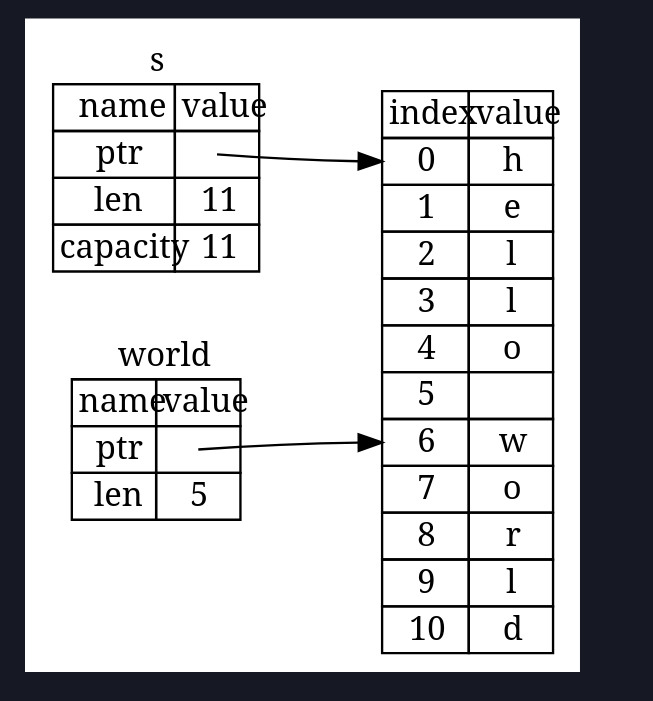

```Rust
fn main() {
    let a = [1, 2, 3, 4, 5];

    let slice = &a[1..3];

    assert_eq!(slice, &[2, 3]);
}
```


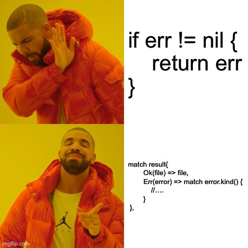

# Packages and Crates

>Ящик (crate) 

— это наименьший объем кода, который компилятор Rust рассматривает за раз.

В большинстве случаев, когда Rustaceans говорят «ящик», 
они имеют в виду библиотечный ящик, 
и они используют «ящик» взаимозаменяемо с общей концепцией программирования «библиотека».

>Пакет (package)

— это наименьший объем кода, который компилятор Rust рассматривает за раз.

>Пути к коду в модулях : как только модуль становится частью вашего ящика, вы можете ссылаться на код в этом модуле из любого места в том же ящике, если это позволяют правила конфиденциальности, используя путь к коду.


>Private vs. public : Код внутри модуля по умолчанию является закрытым от его родительских модулей. Чтобы сделать модуль публичным, объявите его с помощью pub mod вместо mod. Чтобы сделать элементы внутри публичного модуля также публичными, используйте pub перед их объявлениями.


>Ключевое use слово : В области действия useключевое слово создает ярлыки для элементов, чтобы сократить повторение длинных путей. В любой области действия, которая может ссылаться на к примеру crate::garden::vegetables::Asparagus, вы можете создать ярлык с помощью , use crate::garden::vegetables::Asparagus; и с этого момента вам нужно будет только писать, Asparagus чтобы использовать этот тип в области действия.

> Пример организации модулей:

```
my_project/
├── Cargo.toml
├── src/
│   ├── main.rs
│   ├── lib.rs
│   ├── utils/
│   │   ├── file_io.rs
│   │   └── network.rs
│   └── geometry/
│       └── shapes.rs
└── tests/
    └── integration_test.rs
```
    Cargo.toml — файл конфигурации пакета.
    src/main.rs — точка входа для исполняемого файла.
    src/lib.rs — определение библиотечного crate.
     
    Crate  — это минимальная единица компиляции в Rust.
    Каждый пакет содержит хотя бы один crate.
    Существует два типа crates:
        Binary crate:  Создает исполняемый файл (обычно с main.rs).
        Library crate:  Создает библиотеку (обычно с lib.rs).


     
```toml
[package]
name = "my_project"
version = "0.1.0"
edition = "2021"

# Binary crate
[[bin]]
name = "my_binary"
path = "src/bin/my_binary.rs"

# Library crate
[lib]
name = "my_library"
```

А теперь по примерам что внутри по исходникам.

```
my_project/
├── Cargo.toml
├── src/
│   ├── main.rs
│   └── math.rs
```

>NOTE! Нейминг решает!

math.rs
```Rust
pub fn add(a: i32, b: i32) -> i32 {
    a + b
}
```

main.rs
```Rust
mod math; // Подключаем модуль из math.rs

fn main() {
    let result = math::add(2, 3);
    println!("Result: {}", result);
}
```
>Создание сложной структуры

```
my_project/
├── main.rs
├── math
│   ├── geometry
│   │   └── shapes.rs
│   └── geometry.rs
└── math.rs
```

>math/geometry/shapes.rs:

```Rust
pub fn area_of_square(side: i32) -> i32 {
    side * side
}
```

>math/geometry.rs:

```Rust
pub mod shapes;
```

math.rs:
```Rust
pub mod geometry; // Подключаем подмодуль geometry

pub fn calculate_area(side: i32) -> i32 {
    geometry::shapes::area_of_square(side)
}
```

main.rs:
```Rust
mod math;

fn main() {
    let area = math::calculate_area(5);
    println!("Area: {}", area);
}
```


Разделение на библиотеки и исполняемые файлы:  

    src/lib.rs для основной логики.
    src/main.rs для точки входа.
    src/bin/ для дополнительных исполняемых файлов.
     
Если мы используем pubперед определением структуры, мы делаем структуру публичной, но поля структуры по-прежнему будут закрытыми.

По умолчанию для вариантов перечислений установлено значение public. Структуры часто полезны, если их поля не являются публичными, поэтому поля структур следуют общему правилу, согласно которому все по умолчанию является закрытым, если только не аннотировано с помощью pub.

>as

```Rust
use std::fmt::Result;
use std::io::Result as IoResult;

fn function1() -> Result {
    // --snip--
}

fn function2() -> IoResult<()> {
    // --snip--
}
```

>pub use (реэкспорт)

>Вложенные пути

Эти две идентичны

```Rust
// --snip--
use std::cmp::Ordering;
use std::io;
// --snip--
```

```Rust
// --snip--
use std::{cmp::Ordering, io};
// --snip--
```

>И эти две тоже:

```Rust
use std::io;
use std::io::Write;
```

```Rust
use std::io::{self, Write};
```


# Collections

*vector* позволяет хранить переменное количество значений рядом друг с другом.


*string* — это коллекция символов. Мы уже упоминали тип String ранее, но в этой главе мы поговорим о нем подробнее.


*hash map* позволяет связать значение с определенным ключом. Это конкретная реализация более общей структуры данных, называемой картой.


## vec

Создание нового вектора:
```Rust
let v: Vec<i32> = Vec::new();
```

Vec<T>тип, предоставляемый стандартной библиотекой, может содержать любой тип

инициализировать с заранее известными элементами

```Rust
let v = vec![1, 2, 3];
```

Добавление элементов:

```Rust
    let mut v = Vec::new();

    v.push(5);
    v.push(6);
    v.push(7);
    v.push(8);
```

По индексу можем брать как обычно, а можем через .get()

```Rust
pub fn vec_example_get() {
    let v = vec![1, 2, 3, 4, 5];

    let third: &i32 = &v[2];
    println!("The third element is {third}");

    let third: Option<&i32> = v.get(2);
    match third {
        Some(el) => println!("The third element is {el}"),
        None => println!("There is no third element."),
    }
}
```

Использование через get максимально рекомендуется, поскольку если мы зайдём за границы вектора то не получим панику, и обработаем случай сразу.

Я удивлён но это тоже не скомпилируется из соображений безопасности...

Но каких!

(пояснение после демонстрации ошибки компиляции)

```Rust
pub fn vec_reference_and_push() {
    let mut v = vec![1, 2, 3, 4, 5];

    let first = &v[0];

    v.push(6);

    println!("The first element is: {first}");
}
```

```Rust
$ cargo run
   Compiling collections v0.1.0 (file:///projects/collections)
error[E0502]: cannot borrow `v` as mutable because it is also borrowed as immutable
 --> src/main.rs:6:5
  |
4 |     let first = &v[0];
  |                  - immutable borrow occurs here
5 |
6 |     v.push(6);
  |     ^^^^^^^^^ mutable borrow occurs here
7 |
8 |     println!("The first element is: {first}");
  |                                     ------- immutable borrow later used here

For more information about this error, try `rustc --explain E0502`.
error: could not compile `collections` (bin "collections") due to 1 previous error
```

>Код в листинге 8-6 может выглядеть так, как будто он должен работать: почему ссылка на первый элемент должна заботиться об изменениях в конце вектора? Эта ошибка связана со способом работы векторов: поскольку векторы помещают значения рядом друг с другом в памяти, добавление нового элемента в конец вектора может потребовать выделения новой памяти и копирования старых элементов в новое пространство, если недостаточно места для размещения всех элементов рядом друг с другом там, где в данный момент хранится вектор. В этом случае ссылка на первый элемент будет указывать на освобожденную память. Правила заимствования не позволяют программам попадать в такую ​​ситуацию.

Чтож, теперь всё встало на свои места.

*Дополнительная ссылочка на Rustonomicon (о том как выглядит имплементация vec)

https://doc.rust-lang.org/nomicon/vec/vec.html

Пример readonly iterating

```Rust
    let v = vec![100, 32, 57];
    for i in &v {
        println!("{i}");
    }
```

Пример mutable iterating

```Rust
    let mut v = vec![100, 32, 57];
    for i in &mut v {
        *i += 50;
    }
```

    Чтобы изменить значение, на которое ссылается изменяемая ссылка, нам нужно использовать *оператор разыменования, чтобы получить значение в , iпрежде чем мы сможем использовать +=оператор. Мы поговорим больше об операторе разыменования в разделе «Отслеживание указателя на значение с помощью оператора разыменования» главы 15.

## String

>Many of the same operations available with Vec<T> are available with String as well because String is actually implemented as a wrapper around a vector of bytes with some extra guarantees, restrictions, and capabilities

Короче стринги как мы, сишники, плюсовики понимаем, это массив символов, ничего нового. И соответственно для них рабоает то же самое, что и для vec в Rust.

```Rust
let mut s = String::from("somestr");
let mut s = String::new(); // можно и так.
let mut s = s.to_string();

s.push_str(s);
s.push_str("something like that");
s.push('\''); // экранируем и добавляем один символ. В данном случае это '
s.push('a'); // дефолт, экраны не нужны.

// Конкатенация
let s1 = String::from("Hello, ");
let s2 = String::from("world!");
let s3 = s1 + &s2; // note s1 has been moved here and can no longer be used
//Вспоминаем ownership

// Множественный конкат.
let s1 = String::from("tic");
let s2 = String::from("tac");
let s3 = String::from("toe");

let s = format!("{s1}-{s2}-{s3}");


```

Поэкспериментируем! Найдём недосказанность в книге!

Попробовал, кстати, вот так сделать и вот что он мне пишет.

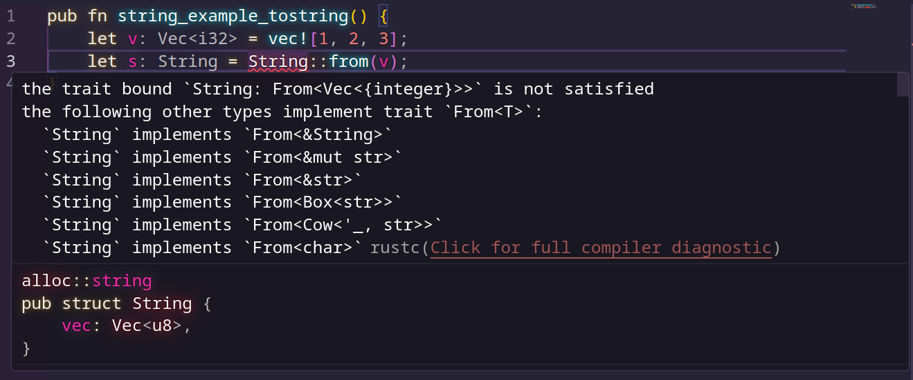

Так же не сработает и это

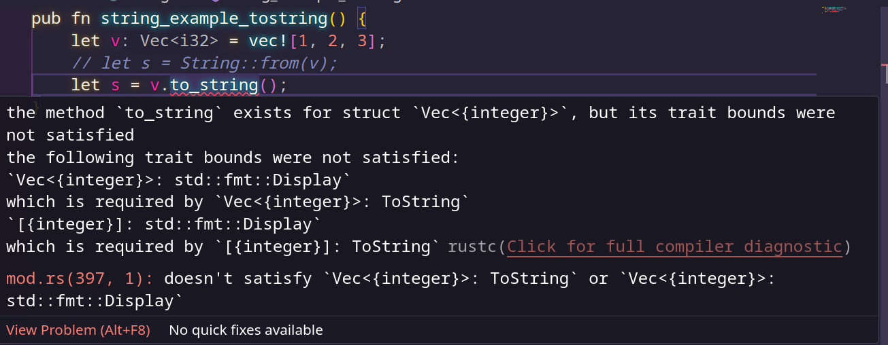

А теперь посмотрим на сигнатуру функции push_str()

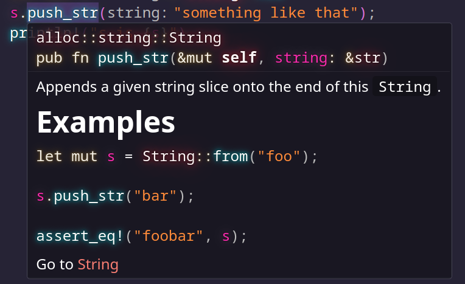

Видим, что принимает ссылку, что достаточно очевидно

Конкатенация работает через + оператор. Изи.

Хотя... Не изи. Немного по другому. 
Мы передаём исходную строку, прибавляем заимствованное, он затем возвращает строку, которую взял во владение. Прибавляемую оставляет (потому что ссылка). И возвращаем взятую во владение. Под капотом мне кажется это работает сложнее, ведь если нужно аллоцировать новую память, то придётся удалить строку и создать новую с конкатенированным результатом.

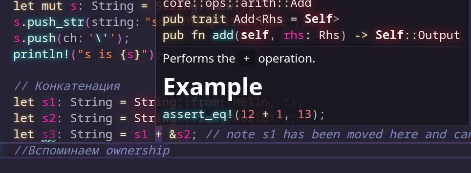

```Rust
    let s1 = String::from("tic");
    let s2 = String::from("tac");
    let s3 = String::from("toe");

    let s = format!("{s1}-{s2}-{s3}");
```

Дальше идёт важная "духота" про то как работают string поглубже, и о том,  
что не так просто получить символ через оператор [], поэтому

https://doc.rust-lang.org/book/ch08-02-strings.html#internal-representation

Вот этот раздел. Там всё описано, в кратце это не распишешь. Плюс полезно если не знаете что да как.

### Итерация по строкам

Как оказывается, итерация не такая простая,   
поэтому вот как рекомендуют итеририроваться

```Rust
for c in "Зд".chars() {
    println!("{c}");
}
```

```Rust
for b in "Зд".bytes() {
    println!("{b}");
}
```

## HashMap

Ассоциативные массивы, или как в питоне dictionary.

```Rust
    use std::collections::HashMap;

    let mut scores = HashMap::new();

    scores.insert(String::from("Blue"), 10);
    scores.insert(String::from("Yellow"), 50);

    let team_name = String::from("Blue");
    // The get method returns an Option<&V>
    let score = scores.get(&team_name).copied().unwrap_or(0);

    // iterating
    for (key, value) in &scores {
        println!("{key}: {value}");
    }

    // check if exists and write of not
    scores.entry(String::from("Yellow")).or_insert(50);
    scores.entry(String::from("Blue")).or_insert(50);
```

И сразу несколько вопросов ставим заранее.  
Как по значению найти ключ?  
Как сохранить порядок (сортировать по last pushed (added/appended))  
Можем ли мы находить по ключу с помощью регулярных выражений?  

>Так а вот это уже интересно. Ещё одна особенность оптимизации Rust! 

    We aren’t able to use the variables field_name and field_value after they’ve been moved into the hash map with the call to insert.


```Rust
    use std::collections::HashMap;

    let field_name = String::from("Favorite color");
    let field_value = String::from("Blue");

    let mut map = HashMap::new();
    map.insert(field_name, field_value);
    // field_name and field_value are invalid at this point, try using them and
    // see what compiler error you get!
```

>Вот так. Если мы хотим вставить туда значения, мы обязательно должны склонировать значения до того как положим в хэшмапу

>Пример группировки используя хешмапу (крутой пример дали, распространённый такой):

```Rust
pub fn group_using_hashmap() {
    use std::collections::HashMap;

    let text = "hello world wonderful world";

    let mut map = HashMap::new();
    // The split_whitespace method returns an iterator over subslices, separated by whitespace, of the value in text
    for word in text.split_whitespace() {
        // The or_insert method returns a mutable reference (&mut V) to the value for the specified key
        let count = map.entry(word).or_insert(0);
        // Here, we store that mutable reference in the count variable, so in order to assign to that value, we must first dereference count using the asterisk (*)
        *count += 1;
        // The mutable reference goes out of scope at the end of the for loop, so all of these changes are safe and allowed by the borrowing rules.
    }

    println!("{map:?}");
}
```

# Error handling

>Rust не имеет try catch (как и в Go) вместо этого ошибки обрабатываются через Result<T, E> а так же panic! макрос который останавливает выполнение когда программа сталкивается с невосстанавливаемой ошибкой. Кроме того рассмотрим когда следует сделать попытку восстановления после ошибки или лучше остановить выполнение

## panic!()

Паники логгируют об ошибке, очищают стек и завершают выполнение.

Про то, как прерывать выполнение без очистки стека рассказано тут - https://doc.rust-lang.org/book/ch09-01-unrecoverable-errors-with-panic.html#unwinding-the-stack-or-aborting-in-response-to-a-panic

>Пример

```Rust
fn main() {
    // panic!("crash and burn"); // custom panic

    let v = vec![1, 2, 3];
    v[99];
}
```

```Shell
$ cargo run
   Compiling panic v0.1.0 (file:///projects/panic)
    Finished `dev` profile [unoptimized + debuginfo] target(s) in 0.27s
     Running `target/debug/panic`
thread 'main' panicked at src/main.rs:4:6:
index out of bounds: the len is 3 but the index is 99
note: run with `RUST_BACKTRACE=1` environment variable to display a backtrace
```


Можем применить RUST_BACKTRACE=1 если хотим рассмотреть панику подробнее:

`RUST_BACKTRACE=1 cargo run`

>Выведет

```Shell
$ RUST_BACKTRACE=1 cargo run
thread 'main' panicked at src/main.rs:4:6:
index out of bounds: the len is 3 but the index is 99
stack backtrace:
   0: rust_begin_unwind
             at /rustc/f6e511eec7342f59a25f7c0534f1dbea00d01b14/library/std/src/panicking.rs:662:5
   1: core::panicking::panic_fmt
             at /rustc/f6e511eec7342f59a25f7c0534f1dbea00d01b14/library/core/src/panicking.rs:74:14
   2: core::panicking::panic_bounds_check
             at /rustc/f6e511eec7342f59a25f7c0534f1dbea00d01b14/library/core/src/panicking.rs:276:5
   3: <usize as core::slice::index::SliceIndex<[T]>>::index
             at /rustc/f6e511eec7342f59a25f7c0534f1dbea00d01b14/library/core/src/slice/index.rs:302:10
   4: core::slice::index::<impl core::ops::index::Index<I> for [T]>::index
             at /rustc/f6e511eec7342f59a25f7c0534f1dbea00d01b14/library/core/src/slice/index.rs:16:9
   5: <alloc::vec::Vec<T,A> as core::ops::index::Index<I>>::index
             at /rustc/f6e511eec7342f59a25f7c0534f1dbea00d01b14/library/alloc/src/vec/mod.rs:2920:9
   6: panic::main
             at ./src/main.rs:4:6
   7: core::ops::function::FnOnce::call_once
             at /rustc/f6e511eec7342f59a25f7c0534f1dbea00d01b14/library/core/src/ops/function.rs:250:5
note: Some details are omitted, run with `RUST_BACKTRACE=full` for a verbose backtrace.
```

## Result

Вот как выглядит Result

```Rust
enum Result<T, E> {
    Ok(T),
    Err(E),
}
```

><T> represents the type of the value that will be returned in a success case within the Ok variant, and <E> represents the type of the error that will be returned in a failure case within the Err variant

```Rust
use std::fs::File;

pub fn open_file() {
    // let greeting_file_result = File::open("hello.txt");
    
    let greeting_file_result = File::open("hello.txt");

    let greeting_file = match greeting_file_result {
        Ok(file) => file,
        Err(error) => panic!("Problem opening the file: {error:?}"), // вот тут сразу бы хотел оборвать, 
        // можно же не паниковать а вернуть какой то код, который можно потом использовать для обработки
    };
}
```

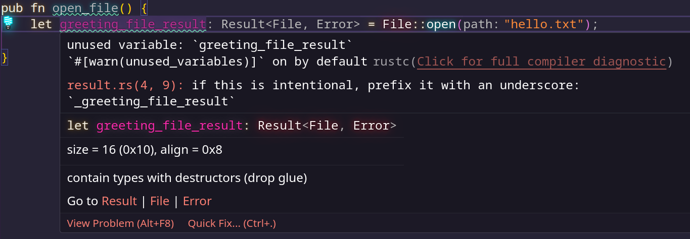

### unpwrap()

```Rust
use std::fs::File;

fn main() {
    let greeting_file = File::open("hello.txt").unwrap(); // разворачиваем enum(Result), уже показывал ранее
}
```

### expect()

```Rust
use std::fs::File;

fn main() {
    let greeting_file = File::open("hello.txt")
        .expect("hello.txt should be included in this project"); // модифицируем панику
}
```

### Propagating Errors

*Propagating это как переводится? Передача ошибок? Ладно, к делу

```Rust
use std::fs::File;
use std::io::{self, Read};

fn read_username_from_file() -> Result<String, io::Error> {
    let username_file_result = File::open("hello.txt");

    let mut username_file = match username_file_result {
        Ok(file) => file,
        Err(e) => return Err(e),
    };

    let mut username = String::new();

    match username_file.read_to_string(&mut username) {
        Ok(_) => Ok(username),
        Err(e) => Err(e),
    }
}

```

В Rust используется Err, а не Error, потому что Err — это вариант перечисления Result, а Error — это тип ошибки, который может быть передан внутри Err.

    T — это String (успешное значение, которое возвращается, если файл удалось прочитать).

    E — это io::Error (тип ошибки, который может возникнуть при работе с файлами).


### ? оператор

```Rust
use std::fs::File;
use std::io::{self, Read};

fn read_username_from_file() -> Result<String, io::Error> {
    let mut username = String::new();

    File::open("hello.txt")?.read_to_string(&mut username)?;

    Ok(username)
}
```

Ещё короче

```Rust
use std::fs;
use std::io;

fn read_username_from_file() -> Result<String, io::Error> {
    fs::read_to_string("hello.txt")
}
```

Ещё один примерчик

```Rust
fn divide(a: i32, b: i32) -> Result<i32, String> {
    if b == 0 {
        return Err("Division by zero".to_string());
    }
    Ok(a / b)
}

fn main() {
    let result = divide(10, 2)?;
    println!("Result: {}", result);
}
```

Для option

```Rust
fn find_value(list: &[i32], target: i32) -> Option<i32> {
    for &value in list {
        if value == target {
            return Some(value);
        }
    }
    None
}

fn main() {
    let list = [1, 2, 3];
    let value = find_value(&list, 2)?;

    println!("Found: {}", value);
}
```

6. Как это работает под капотом:  

Оператор ? — это синтаксический сахар для следующей конструкции: 
Для Result:  

```Rust
match value {
    Ok(v) => v,
    Err(e) => return Err(e.into()),
}
```

Для Option:

```Rust
match value {
    Some(v) => v,
    None => return None,
}
```

3. Почему нельзя смешивать Result и Option?

Оператор ? не может автоматически преобразовать Result в Option или наоборот. Если вам нужно такое преобразование, используйте методы:

    .ok() для преобразования Result в Option.

    .ok_or() для преобразования Option в Result.


# Generics Traits Lifetime

## generics

Соглашение об именовании типов в Rust - UpperCamelCase

```Rust
struct Point<T> {
    x: T,
    y: T,
}

impl<T> Point<T> {
    fn x(&self) -> &T {
        &self.x
    }
    fn distance_from_origin(&self) -> f32 {
        (self.x.powi(2) + self.y.powi(2)).sqrt()
    }
}

fn main() {
    let p = Point { x: 5, y: 10 };
    println!("p.x = {}", p.x());
}
```

Очевидное не скомпилится и в других языках, но вот для закрепления:

```Rust
struct Point<T> {
    x: T,
    y: T,
}

fn main() {
    let wont_work = Point { x: 5, y: 4.0 };
}
```

```Shell
$ cargo run
   Compiling chapter10 v0.1.0 (file:///projects/chapter10)
error[E0308]: mismatched types
 --> src/main.rs:7:38
  |
7 |     let wont_work = Point { x: 5, y: 4.0 };
  |                                      ^^^ expected integer, found floating-point number

For more information about this error, try `rustc --explain E0308`.
error: could not compile `chapter10` (bin "chapter10") due to 1 previous error
```

Если нужно два типа в структуре можно сделать и так:

```Rust
struct Point<T, U> {
    x: T,
    y: U,
}

fn main() {
    let both_integer = Point { x: 5, y: 10 };
    let both_float = Point { x: 1.0, y: 4.0 };
    let integer_and_float = Point { x: 5, y: 4.0 };
}
```


>Рассмотрим более сложный пример где мы возвращаем новую экземпляр структуры но с смешанными полями:

```Rust
struct Point<X1, Y1> {
    x: X1,
    y: Y1,
}

impl<X1, Y1> Point<X1, Y1> {
    fn mixup<X2, Y2>(self, other: Point<X2, Y2>) -> Point<X1, Y2> {
        Point {
            x: self.x,
            y: other.y,
        }
    }
}

fn main() {
    let p1 = Point { x: 5, y: 10.4 };
    let p2 = Point { x: "Hello", y: 'c' };

    let p3 = p1.mixup(p2);

    println!("p3.x = {}, p3.y = {}", p3.x, p3.y);
}
```

### performance issue

Нет, не замедляется скорость выполнения, поскольку Rust использует мономорфизацию.

https://doc.rust-lang.org/book/ch10-01-syntax.html#performance-of-code-using-generics

https://habr.com/ru/companies/vk/articles/461321/


## traits

Таак, черты похожи на интерфейсы но есть отличия.

A type’s behavior consists of the methods we can call on that type. Different types share the same behavior if we can call the same methods on all of those types.

### Реализация трейта для типа  
Трейт `Summary` определяет метод `summarize()`. Реализуем его для структур `NewsArticle` и `Tweet`:

#### Код (src/lib.rs):
```rust
// NewsArticle
pub struct NewsArticle {
    pub headline: String,
    pub location: String,
    pub author: String,
    pub content: String,
}

impl Summary for NewsArticle {
    fn summarize(&self) -> String {
        format!("{}, by {} ({})", self.headline, self.author, self.location)
    }
}

// Tweet
pub struct Tweet {
    pub username: String,
    pub content: String,
    pub reply: bool,
    pub retweet: bool,
}

impl Summary for Tweet {
    fn summarize(&self) -> String {
        format!("{}: {}", self.username, self.content)
    }
}
```

---

### Ключевые моменты:  
1. **Синтаксис реализации**:  
   ```rust
   impl ИмяТрейта for Тип { ... }
   ```  
   Например: `impl Summary for NewsArticle`.

2. **Использование трейта**:  
   Чтобы вызывать методы трейта, его нужно добавить в область видимости:
   ```rust
   use aggregator::{Summary, Tweet};

   fn main() {
       let tweet = Tweet { /* ... */ };
       println!("{}", tweet.summarize()); // "horse_ebooks: ..."
   }
   ```

---

### Орфанные правила (Orphan Rule)  
Можно реализовать трейт для типа **только если**:  
- Трейт **или** тип локальны для вашего крейта.  

#### Примеры:  
- ✅ Разрешено:  
  ```rust
    // Ваш крейт определяет трейт Summary и тип Tweet
  impl Summary for Tweet { ... } 
    // Ваш крейт определяет тип Tweet, Display — внешний трейт
  impl Display for Tweet { ... } 
    // Ваш крейт определяет трейт Summary и тип Vec<T>
  impl Summary for Vec<T> { ... } 
  ```

- ❌ Запрещено:  
  ```rust
  // Vec<T> и Display — внешние типы/трейты
  impl Display for Vec<T> { ... } 
  ```  

**Причина**: предотвращение конфликтов реализаций между крейтами.

---

### Использование трейтов как параметров функций  
Трейты позволяют определять функции, которые работают с разными типами, реализующими указанный трейт.

---

#### 1. **Базовый синтаксис `impl Trait`**  
Функция принимает любой тип, реализующий трейт `Summary`:  
```rust
pub fn notify(item: &impl Summary) {
    println!("Новость: {}", item.summarize());
}
```
- **Особенности**:  
  - `item` может быть `NewsArticle`, `Tweet` и т.д.  
  - Нельзя использовать разные типы для нескольких параметров (если не указано иначе).  

---

#### 2. **Явные ограничения трейтов (Trait Bounds)**  
Эквивалентная запись с использованием дженериков:  
```rust
pub fn notify<T: Summary>(item: &T) {
    println!("Новость: {}", item.summarize());
}
```
- **Когда использовать**:  
  - Если нужно явно указать тип или использовать его в нескольких местах.  
  - Для ограничения нескольких параметров одним типом:  
    ```rust
    // item1 и item2 должны быть одного типа (например, оба Tweet)
    pub fn notify<T: Summary>(item1: &T, item2: &T) {}
    ```

---

#### 3. **Комбинирование трейтов (`+`)**  
Требуем реализацию нескольких трейтов:  
```rust
// Через impl Trait:
pub fn notify(item: &(impl Summary + Display)) {}

// Через trait bounds:
pub fn notify<T: Summary + Display>(item: &T) {}
```
- **Пример использования**:  
  ```rust
  // item можно и форматировать через {}, и вызывать summarize()
  println!("{}: {}", item, item.summarize());
  ```

---

#### 4. **Упрощение сложных сигнатур с `where`**  
Для улучшения читаемости при множестве ограничений:  
```rust
// Без where:
fn some_function<T: Display + Clone, U: Clone + Debug>(t: &T, u: &U) -> i32 {}

// С where:
fn some_function<T, U>(t: &T, u: &U) -> i32
where
    T: Display + Clone,
    U: Clone + Debug,
{}
```
- **Преимущества**:  
  - Сигнатура функции не загромождается.  
  - Удобно для сложных сценариев (например, 3+ дженерика).  

---

### Возврат типов, реализующих трейты  
Используйте `impl Trait` в возвращаемой позиции, чтобы указать, что функция возвращает значение, реализующее определённый трейт, без указания конкретного типа.

---

#### 1. **Базовый пример**  
Функция возвращает `Tweet`, но тип указан как `impl Summary`:  
```rust
fn returns_summarizable() -> impl Summary {
    Tweet {
        username: String::from("horse_ebooks"),
        content: String::from("of course..."),
        reply: false,
        retweet: false,
    }
}
```  
- **Вызывающий код** знает только, что возвращаемый тип реализует `Summary`.  
- **Преимущество**: Сокрытие деталей реализации (например, для сложных типов вроде замыканий или итераторов).

---

#### 2. **Где это полезно?**  
- **Замыкания и итераторы**: Их типы часто анонимны или очень длинные.  
  Пример:  
  ```rust
  fn create_iterator() -> impl Iterator<Item = i32> {
      (1..10).map(|x| x * 2)
  }
  ```  
- **Упрощение кода**: Избегаем сложных аннотаций типов.

---

#### 3. **Ограничение**  
Функция **не может** возвращать разные типы, даже если они реализуют один трейт:  
```rust
// Ошибка компиляции!
fn returns_summarizable(switch: bool) -> impl Summary {
    if switch {
        NewsArticle { /* ... */ }  // Один тип
    } else {
        Tweet { /* ... */ }        // Другой тип
    }
}
```  
- **Причина**: `impl Trait` требует **единственный** конкретный тип на этапе компиляции.  
- **Решение**: Использовать трейт-объекты (`dyn Trait`), как описано в главе 17.

---

И снова я восхищаюсь Rust'ом.

### Условная реализация методов через ограничения трейтов  
Трейт-баунды позволяют добавлять методы к типам только при выполнении условий (например, если тип реализует нужные трейты).

---

#### 1. **Пример: структура `Pair<T>`**  
```rust
use std::fmt::Display;

struct Pair<T> {
    x: T,
    y: T,
}

// Всегда реализуется для любого T
impl<T> Pair<T> {
    fn new(x: T, y: T) -> Self {
        Self { x, y }
    }
}

// Реализуется только для T, поддерживающих сравнение (PartialOrd) и вывод (Display)
impl<T: Display + PartialOrd> Pair<T> {
    fn cmp_display(&self) {
        if self.x >= self.y {
            println!("Наибольший элемент: x = {}", self.x);
        } else {
            println!("Наибольший элемент: y = {}", self.y);
        }
    }
}
```
- **`new()`** доступен для любого `T`.  
- **`cmp_display()`** доступен только если `T: Display + PartialOrd`.  

---

#### 2. **Blanket-реализации**  
Это реализация трейта для **всех типов**, удовлетворяющих условиям. Пример из стандартной библиотеки:  
```rust
// Для любого типа T с трейтом Display автоматически реализуется ToString
impl<T: Display> ToString for T {
    fn to_string(&self) -> String {
        // ...
    }
}

// Использование
let s = 5.to_string(); // Работает, т.к. i32 реализует Display
```  
- **Польза**: Не нужно вручную реализовывать `ToString` для каждого типа с `Display`.  

---

#### 3. **Преимущества проверки на этапе компиляции**  
- **Ошибки обнаруживаются при компиляции**, а не в рантайме.  
- **Нет накладных расходов** на проверки в рантайме.  
- Пример ошибки:  
  ```rust
  let pair = Pair { x: vec![1], y: vec![2] };
  pair.cmp_display(); // Ошибка: Vec<i32> не реализует Display
  ```  

---

## lifetime

```Rust
fn main() {
    let r;                // ---------+-- 'a
                          //          |
    {                     //          |
        let x = 5;        // -+-- 'b  |
        r = &x;           //  |       |
    }                     // -+       |
                          //          |
    println!("r: {r}");   //          |
}                         // ---------+
```

>Примечание: Примеры в листинге 10-16, 10-17 и 10-23 объявляют переменные без присвоения им начального значения, поэтому имя переменной существует во внешней области видимости. На первый взгляд может показаться, что это противоречит отсутствию в Rust нулевых значений. Однако, если мы попытаемся использовать переменную до присвоения ей значения, мы получим ошибку времени компиляции, которая показывает, что Rust действительно не допускает нулевых значений.

```
$ cargo run
   Compiling chapter10 v0.1.0 (file:///projects/chapter10)
error[E0597]: `x` does not live long enough
 --> src/main.rs:6:13
  |
5 |         let x = 5;
  |             - binding `x` declared here
6 |         r = &x;
  |             ^^ borrowed value does not live long enough
7 |     }
  |     - `x` dropped here while still borrowed
8 |
9 |     println!("r: {r}");
  |                  --- borrow later used here

For more information about this error, try `rustc --explain E0597`.
error: could not compile `chapter10` (bin "chapter10") due to 1 previous error
```

>Во время компиляции Rust сравнивает размер двух времен жизни и видит, что rимеет время жизни , 'aно ссылается на память со временем жизни 'b. Программа отклоняется, потому что временя жизни 'b заканчивается раньше, чем 'a: субъект ссылки не живет так долго, как ссылка.

Ещё рассмотрим пример как компилятор проверяет ссылки:

```Rust
fn longest(x: &str, y: &str) -> &str {
    if x.len() > y.len() {
        x
    } else {
        y
    }
}
```

>Текст справки показывает, что возвращаемому типу необходим общий параметр времени жизни, поскольку Rust не может определить, ссылается ли возвращаемая ссылка на x или y. 

```
$ cargo run
   Compiling chapter10 v0.1.0 (file:///projects/chapter10)
error[E0106]: missing lifetime specifier
 --> src/main.rs:9:33
  |
9 | fn longest(x: &str, y: &str) -> &str {
  |               ----     ----     ^ expected named lifetime parameter
  |
  = help: this function's return type contains a borrowed value, but the signature does not say whether it is borrowed from `x` or `y`
help: consider introducing a named lifetime parameter
  |
9 | fn longest<'a>(x: &'a str, y: &'a str) -> &'a str {
  |           ++++     ++          ++          ++

For more information about this error, try `rustc --explain E0106`.
error: could not compile `chapter10` (bin "chapter10") due to 1 previous error
```


# tests

```Rust
$ cargo new adder --lib
     Created library `adder` project
$ cd adder
```

```Rust
pub fn add(left: u64, right: u64) -> u64 {
    left + right
}

#[cfg(test)]
mod tests {
    use super::*;

    #[test]
    fn it_works() {
        let result = add(2, 2);
        assert_eq!(result, 4);
    }
}
```

```Rust
$ cargo test
   Compiling adder v0.1.0 (file:///projects/adder)
    Finished `test` profile [unoptimized + debuginfo] target(s) in 0.57s
     Running unittests src/lib.rs (file:///projects/adder/target/debug/deps/adder-7acb243c25ffd9dc)

running 1 test
test tests::it_works ... ok

test result: ok. 1 passed; 0 failed; 0 ignored; 0 measured; 0 filtered out; finished in 0.00s

   Doc-tests adder

running 0 tests

test result: ok. 0 passed; 0 failed; 0 ignored; 0 measured; 0 filtered out; finished in 0.00s
```

>Как выглядит зафейленный тест

```Rust
$ cargo test
   Compiling adder v0.1.0 (file:///projects/adder)
    Finished `test` profile [unoptimized + debuginfo] target(s) in 0.72s
     Running unittests src/lib.rs (target/debug/deps/adder-92948b65e88960b4)

running 2 tests
test tests::another ... FAILED
test tests::exploration ... ok

failures:

---- tests::another stdout ----
thread 'tests::another' panicked at src/lib.rs:17:9:
Make this test fail
note: run with `RUST_BACKTRACE=1` environment variable to display a backtrace


failures:
    tests::another

test result: FAILED. 1 passed; 1 failed; 0 ignored; 0 measured; 0 filtered out; finished in 0.00s

error: test failed, to rerun pass `--lib`

```

>В структурах

```Rust
#[derive(Debug)]
struct Rectangle {
    width: u32,
    height: u32,
}

impl Rectangle {
    fn can_hold(&self, other: &Rectangle) -> bool {
        self.width > other.width && self.height > other.height
    }
}
```

>testим

```Rust
#[cfg(test)]
mod tests {
    use super::*;

    #[test]
    fn larger_can_hold_smaller() {
        let larger = Rectangle {
            width: 8,
            height: 7,
        };
        let smaller = Rectangle {
            width: 5,
            height: 1,
        };

        assert!(larger.can_hold(&smaller));
    }
}
```

## Testing Equality with the assert_eq! and assert_ne! Macros

```Rust
pub fn add_two(a: usize) -> usize {
    a + 2
}

#[cfg(test)]
mod tests {
    use super::*;

    #[test]
    fn it_adds_two() {
        let result = add_two(2);
        assert_eq!(result, 4);
    }
}
```

Note that in some languages and test frameworks, the parameters to equality assertion functions are called expected and actual, and the order in which we specify the arguments matters. However, in Rust, they’re called left and right, and the order in which we specify the value we expect and the value the code produces doesn’t matter. We could write the assertion in this test as assert_eq!(4, result), which would produce the same failure message that displays assertion failed: `(left == right)`.

The assert_ne! macro will pass if the two values we give it are not equal and fail if they’re equal. This macro is most useful for cases when we’re not sure what a value will be, but we know what the value definitely shouldn’t be. For example, if we’re testing a function that is guaranteed to change its input in some way, but the way in which the input is changed depends on the day of the week that we run our tests, the best thing to assert might be that the output of the function is not equal to the input.

## Adding Custom Failure Messages

```Rust
pub fn greeting(name: &str) -> String {
    format!("Hello {name}!")
}

#[cfg(test)]
mod tests {
    use super::*;

    #[test]
    fn greeting_contains_name() {
        let result = greeting("Carol");
        assert!(
            result.contains("Carol"),
            "Greeting did not contain name, value was `{result}`"
        );
    }
}
```

## Checking for Panics with should_panic

```Rust
pub struct Guess {
    value: i32,
}

impl Guess {
    pub fn new(value: i32) -> Guess {
        if value < 1 || value > 100 {
            panic!("Guess value must be between 1 and 100, got {value}.");
        }

        Guess { value }
    }
}

#[cfg(test)]
mod tests {
    use super::*;

    #[test]
    #[should_panic]
    fn greater_than_100() {
        Guess::new(200);
    }
}
```

```Rust
$ cargo test
   Compiling guessing_game v0.1.0 (file:///projects/guessing_game)
    Finished `test` profile [unoptimized + debuginfo] target(s) in 0.58s
     Running unittests src/lib.rs (target/debug/deps/guessing_game-57d70c3acb738f4d)

running 1 test
test tests::greater_than_100 - should panic ... ok

test result: ok. 1 passed; 0 failed; 0 ignored; 0 measured; 0 filtered out; finished in 0.00s

   Doc-tests guessing_game

running 0 tests

test result: ok. 0 passed; 0 failed; 0 ignored; 0 measured; 0 filtered out; finished in 0.00s


```

## Using Result<T, E> in Tests

```Rust
    #[test]
    fn it_works() -> Result<(), String> {
        let result = add(2, 2);

        if result == 4 {
            Ok(())
        } else {
            Err(String::from("two plus two does not equal four"))
        }
    }

```

## Управление выполнением тестов в Rust  

#### 1. **Запуск тестов: параллельно или последовательно**  
По умолчанию `cargo test` запускает тесты **параллельно** в нескольких потоках, что ускоряет выполнение. Однако это может вызвать проблемы, если тесты используют общие ресурсы (например, файлы или переменные среды).  

- **Пример проблемы**:  
  Если два теста записывают данные в один файл `test-output.txt`, они могут конфликтовать.  

- **Решение**:  
  Запуск тестов в **одном потоке** для изоляции:  
  ```bash  
  cargo test -- --test-threads=1  
  ```  

---

#### 2. **Отображение вывода функций**  
По умолчанию Rust **скрывает вывод** (например, `println!`) для успешных тестов, показывая его только для упавших.  

- **Пример**:  
  ```rust  
  fn prints_and_returns_10(a: i32) -> i32 {  
      println!("I got the value {a}");  
      10  
  }  

  #[test]  
  fn passing_test() {  
      assert_eq!(prints_and_returns_10(4), 10);  
  }  

  #[test]  
  fn failing_test() {  
      assert_eq!(prints_and_returns_10(8), 5);  // Тест упадёт  
  }  
  ```  

  - Вывод для `cargo test`:  
    ```  
    test failing_test ... FAILED  
    test passing_test ... ok  
    ```  
    Сообщение `I got the value 4` не отображается (тест прошёл).  

- **Показать вывод для всех тестов**:  
  ```bash  
  cargo test -- --show-output  
  ```  

---

#### 3. **Запуск подмножества тестов**  
Можно запускать тесты по **имени**, **части имени** или **модулю**.  

- **Запуск одного теста**:  
  ```bash  
  cargo test one_hundred  # Запустит тест с именем `one_hundred`  
  ```  

- **Запуск тестов по фильтру**:  
  ```bash  
  cargo test add  # Запустит все тесты, в имени которых есть `add`  
  ```  

---

#### 4. **Игнорирование тестов**  
Если тест требует много времени или ресурсов, его можно пометить атрибутом `#[ignore]`.  

- **Пример**:  
  ```rust  
  #[test]  
  #[ignore]  
  fn expensive_test() {  
      // Долгие вычисления...  
  }  
  ```  

- **Запуск только игнорируемых тестов**:  
  ```bash  
  cargo test -- --ignored  
  ```  

- **Запуск всех тестов (включая игнорируемые)**:  
  ```bash  
  cargo test -- --include-ignored  
  ```  

---

### Основные команды  
| Команда                          | Описание                                  |  
|----------------------------------|------------------------------------------|  
| `cargo test`                     | Запуск всех тестов.                      |  
| `cargo test -- --test-threads=1` | Запуск тестов в одном потоке.            |  
| `cargo test -- --show-output`    | Показать вывод для успешных тестов.      |  
| `cargo test [часть_имени]`       | Запуск тестов, чьи имена содержат текст. |  
| `cargo test -- --ignored`        | Запуск только игнорируемых тестов.       |  

---

### Итог  
- **Параллелизм**: Ускоряет тесты, но требует осторожности с общими ресурсами.  
- **Фильтрация**: Позволяет гибко выбирать тесты для запуска.  
- **Игнорирование**: Удобно для временного отключения долгих тестов.  
- **Вывод**: По умолчанию скрыт для успешных тестов — используйте `--show-output`, чтобы его увидеть.  

Эти инструменты помогают эффективно работать с тестами, адаптируя их выполнение под ваши задачи. 🦀

## unit and integration tests

    Эта штука будет гарантировать что тесты не запустятся при `cargo build`

```Rust
pub fn add_two(a: usize) -> usize {
    internal_adder(a, 2)
}

fn internal_adder(left: usize, right: usize) -> usize {
    left + right
}

#[cfg(test)]
mod tests {
    use super::*;

    #[test]
    fn internal() {
        let result = internal_adder(2, 2);
        assert_eq!(result, 4);
    }
}
```

> test private functions is allowed in rust

### integration tests

```
adder
├── Cargo.lock
├── Cargo.toml
├── src
│   └── lib.rs
└── tests
    └── integration_test.rs
```

```Rust
use adder::add_two;

#[test]
fn it_adds_two() {
    let result = add_two(2);
    assert_eq!(result, 4);
}
```

Три раздела вывода включают модульные тесты, интеграционный тест и тесты документации. Обратите внимание, что если какой-либо тест в разделе не пройден, следующие разделы не будут запущены. Например, если модульный тест не пройден, то не будет никаких выходных данных для интеграционных и документационных тестов, поскольку эти тесты будут запущены только в том случае, если все модульные тесты пройдены.

```Rust

```

```Rust

```

```rust
use std::env;

fn main() {
    let args: Vec<String> = env::args().collect();
    dbg!(args);
}
```

```
The args Function and Invalid Unicode

Note that std::env::args will panic if any argument contains invalid Unicode. If your program needs to accept arguments containing invalid Unicode, use std::env::args_os instead. That function returns an iterator that produces OsString values instead of String values. We’ve chosen to use std::env::args here for simplicity because OsString values differ per platform and are more complex to work with than String values.

/src/me/rust/minigrep> cargo run -- dgdf!@&dsjf
   Compiling minigrep v0.1.0 (/home/wave/src/me/rust/minigrep)
    Finished `dev` profile [unoptimized + debuginfo] target(s) in 0.22s
     Running `target/debug/minigrep 'dgdf'\!'@&dsjf'`

thread 'main' panicked at src/main.rs:6:26:
index out of bounds: the len is 2 but the index is 2
note: run with `RUST_BACKTRACE=1` environment variable to display a backtrace

```

Кстати, можем заметить, аннотировать тип обязательно.

*Принцип TDD

https://ru.wikipedia.org/wiki/Разработка_через_тестирование

# CLI

## ENVs

Примерно так:

```rust
let ignore_case = env::var("IGNORE_CASE").is_ok();
```

```rust

eprintln!("Problem parsing arguments: {err}");
```

## flag processing

Отличный вопрос! В Rust есть несколько способов **парсить флаги командной строки**, от простых до мощных и гибких. Я покажу тебе разные подходы — от базового ручного парсинга до использования популярных библиотек.

---

### 🧠 Цель: получить аргументы из CLI

Пример команды:

```bash
myapp --name John --verbose -l en --age 30
```

Мы хотим:
- Получить значения по ключам (`--name`, `--age`).
- Проверить, установлен ли флаг (`--verbose`).
- Обработать короткие опции (`-l`).

---

#### ✅ Способ 1: Ручной парсинг через `std::env::args()`

Если нужно быстро и просто:

```rust
use std::env;

fn main() {
    let args: Vec<String> = env::args().collect();

    for i in 0..args.len() {
        match args[i].as_str() {
            "--name" => {
                if i + 1 < args.len() {
                    println!("Имя: {}", args[i + 1]);
                }
            }
            "--age" => {
                if i + 1 < args.len() {
                    if let Ok(age) = args[i + 1].parse::<u8>() {
                        println!("Возраст: {}", age);
                    }
                }
            }
            "--verbose" => {
                println!("Вербозный вывод включен");
            }
            _ => {}
        }
    }
}
```

###### 👍 Плюсы:
- Нет зависимостей.
- Просто понять.

###### 👎 Минусы:
- Много boilerplate.
- Неудобно для сложных приложений.

---

#### ✅ Способ 2: Использовать крейт `clap`

**`clap`** — это **самый популярный** и мощный крейт для парсинга аргументов в Rust.

###### 🔧 Установка (в `Cargo.toml`):

```toml
[dependencies]
clap = { version = "4.0", features = ["derive"] }
```

##### 📦 Пример с derive-макросом:

```rust
use clap::{Parser};

#[derive(Parser)]
#[command(author, version, about = "CLI-приложение для демонстрации clap")]
struct Cli {
    /// Имя пользователя
    #[arg(short, long)]
    name: String,

    /// Возраст
    #[arg(short, long)]
    age: Option<u8>,

    /// Включить подробный вывод
    #[arg(short, long)]
    verbose: bool,

    /// Язык
    #[arg(short = 'l', long)]
    language: Option<String>,
}

fn main() {
    let cli = Cli::parse();

    println!("Имя: {}", cli.name);

    if let Some(age) = cli.age {
        println!("Возраст: {}", age);
    }

    if cli.verbose {
        println!("Подробный режим включен");
    }

    if let Some(lang) = cli.language {
        println!("Язык: {}", lang);
    }
}
```

##### Пример запуска:

```bash
cargo run -- --name Alice --age 25 -l ru --verbose
```

##### 👍 Плюсы:
- Автоматически создаёт help / version.
- Поддерживает короткие и длинные флаги.
- Типобезопасный.
- Отличная документация.

##### 👎 Минусы:
- Больше зависимостей.
- Нужно немного больше кода.

---

#### ✅ Способ 3: Использовать `anyhow` + `clap` для обработки ошибок

Если хочешь красиво обрабатывать ошибки:

```toml
[dependencies]
clap = { version = "4.0", features = ["derive"] }
anyhow = "1.0"
```

```rust
use anyhow::{Context, Result};
use clap::Parser;

#[derive(Parser)]
struct Cli {
    #[arg(short, long)]
    name: String,
}

fn main() -> Result<()> {
    let cli = Cli::parse();
    anyhow::ensure!(!cli.name.is_empty(), "Имя не может быть пустым");

    println!("Привет, {}", cli.name);
    Ok(())
}
```

## 📌 Когда что использовать?

| Задача | Что выбрать |
|-------|-------------|
| Серьёзное приложение с флагами | `clap` с `derive` |
| Нужен красивый вывод ошибок | `clap` + `anyhow` |


# iterators closures


```
Замыкания Rust — это анонимные функции, которые можно сохранить в переменной или передать в качестве аргументов другим функциям. Вы можете создать замыкание в одном месте, а затем вызвать его в другом месте, чтобы оценить его в другом контексте. В отличие от функций, замыкания могут захватывать значения из области действия, в которой они определены. Мы покажем, как эти возможности замыканий позволяют повторно использовать код и настраивать поведение.
```


Отлично, переформулировка помогает уточнить суть! Давай разберём:

---

### 🧩 **Какие проблемы в Rust решаются с помощью замыканий и итераторов?**

В Rust есть ряд особенностей и ограничений, которые могут усложнять написание кода. Однако **замыкания** и **итераторы** — мощные инструменты, которые помогают **решать эти проблемы или облегчать их**.

---

#### 1. **Проблема: Сложность работы с коллекциями**
- Вручную писать циклы `for` + `if` + `push` неудобно.
- Можно ошибиться с индексами, мьютабельностью, условиями.

✅ **Решение: Итераторы**
```rust
let even_squares: Vec<_> = (1..10)
    .filter(|x| x % 2 == 0)
    .map(|x| x * x)
    .collect();
```

---

#### 2. **Проблема: Чистота кода и читаемость**
- Многословный код сложно читать.
- Логика фильтрации/преобразования теряется в циклах.

✅ **Решение: Замыкания + итераторы делают код декларативным**
```rust
let filtered: Vec<_> = items.iter().filter(|item| item.is_valid()).collect();
```

Теперь видно сразу:
> "Я фильтрую элементы по признаку `is_valid`".

---

#### 3. **Проблема: Работа с Option / Result**
- Проверять каждое значение через `match` или `if let` неудобно.
- Код становится многослойным.

✅ **Решение: `filter_map`, `map`, `and_then`**
```rust
let numbers: Vec<_> = strings
    .iter()
    .filter_map(|s| s.parse::<i32>().ok())
    .collect();
```

Так ты легко пропускаешь ошибки парсинга и собираешь только успешные значения.

---

#### 4. **Проблема: Безопасная работа с данными**
- В Rust нельзя модифицировать коллекцию, по которой ты итерируешься.
- Это может вызвать ошибки компиляции.

✅ **Решение: Итераторы позволяют работать с данными без мутации**
```rust
let doubled: Vec<_> = vec![1, 2, 3].into_iter().map(|x| x * 2).collect();
```

---

#### 5. **Проблема: Параллелизм и асинхронность**
- Ручное распределение задач между потоками сложно.

✅ **Решение: Библиотеки вроде `rayon` используют замыкания для параллельной обработки**
```rust
use rayon::prelude::*;

let sum: i32 = (0..1000).into_par_iter().map(|x| x * 2).sum();
```

---

### 🧠 А теперь к твоему второму вопросу:

### 🔍 Какие задачки решаются с помощью замыканий и итераторов?

Вот список типовых задач, которые идеально подходят под функциональный стиль Rust:

---

#### ✅ 1. Фильтрация данных

```rust
let adults = people.iter().filter(|p| p.age >= 18);
```

---

### ✅ 2. Преобразование данных

```rust
let squares = numbers.iter().map(|x| x * x);
```

---

#### ✅ 3. Поиск элемента

```rust
let found = list.iter().find(|&&x| x == target);
```

---

#### ✅ 4. Подсчёт чего-либо

```rust
let count = items.iter().filter(|x| x.is_important()).count();
```

---

#### ✅ 5. Агрегация (сумма, минимум, максимум)

```rust
let total = values.iter().sum::<i32>();
let max = values.iter().max();
```

---

#### ✅ 6. Обработка результатов

```rust
let results = [Ok(1), Err("fail"), Ok(3)];
let sum = results.iter().filter_map(|r| r.ok()).sum::<i32>();
```

---

#### ✅ 7. Комбинирование коллекций

```rust
let combined: Vec<_> = names
    .iter()
    .zip(ages.iter())
    .map(|(name, age)| format!("{} - {}", name, age))
    .collect();
```

---

#### ✅ 8. Группировка и преобразование

```rust
let grouped: HashMap<_, _> = data
    .iter()
    .map(|item| (item.key(), item.value()))
    .into_group_map();
```

> Для этого нужен `itertools` (`use itertools::Itertools;`)

---

#### ✅ 9. Ленивая обработка

```rust
let first_few = numbers.iter().take(5); // берём первые 5 элементов
```

---

#### ✅ 10. Параллельная обработка (через `rayon`)

```rust
let sum = (0..1000).into_par_iter().map(|x| x * x).sum();
```

| Проблема в Rust | Как решается замыканиями/итераторами |
|----------------|--------------------------------------|
| Сложность работы с коллекциями | Через `map`, `filter`, `fold` |
| Нечитаемый код | Через декларативный стиль |
| Работа с `Option`/`Result` | Через `filter_map`, `map`, `and_then` |
| Безопасность владения | Через ленивые и ненавязчивые итераторы |
| Параллелизм | Через `rayon` и замыкания |

---

| Задача | Инструмент |
|-------|------------|
| Фильтрация | `.filter()` |
| Преобразование | `.map()` |
| Поиск | `.find()`, `.position()` |
| Агрегация | `.sum()`, `.min()`, `.max()` |
| Объединение | `.zip()`, `.chain()` |
| Группировка | `.into_group_map()` (из `itertools`) |
| Параллелизм | `.par_iter()` из `rayon` |


Пример замыкания:

```rust
user_preference.unwrap_or_else(|| self.most_stocked())

let expensive_closure = |num: u32| -> u32 {
    println!("calculating slowly...");
    thread::sleep(Duration::from_secs(2));
    num
};
```

Одинаково:  
```rust
fn  add_one_v1   (x: u32) -> u32 { x + 1 }
let add_one_v2 = |x: u32| -> u32 { x + 1 };
let add_one_v3 = |x|             { x + 1 };
let add_one_v4 = |x|               x + 1  ;
```

Обратите внимание, что мы не добавили никаких аннотаций типов к определению. Поскольку аннотаций типов нет, мы можем вызвать замыкание с любым типом, что мы и сделали здесь в Stringпервый раз. Если мы затем попытаемся вызвать example_closureс целым числом, мы получим ошибку.

Имя файла: src/main.rs
Этот код не компилируется!

```rust
    let example_closure = |x| x;

    let s = example_closure(String::from("hello"));
    let n = example_closure(5);
```

При первом вызове example_closureсо Stringзначением компилятор выводит тип xи возвращаемый тип замыкания как String. Затем эти типы блокируются в замыкании в example_closure, и мы получаем ошибку типа, когда в следующий раз пытаемся использовать другой тип с тем же замыканием.

Пример иммутабельного замыкания:  
```rust
fn main() {
    let list = vec![1, 2, 3];
    println!("Before defining closure: {list:?}");

    let only_borrows = || println!("From closure: {list:?}");

    println!("Before calling closure: {list:?}");
    only_borrows();
    println!("After calling closure: {list:?}");
}
```

Пример мутабельного замыкания (вызовет ошибку):    
```Rust
fn main() {
    let mut list = vec![1, 2, 3];
    println!("Before defining closure: {list:?}");

    let mut borrows_mutably = || list.push(7);
    println!("Before calling closure: {list:?}");
    borrows_mutably();
    println!("After calling closure: {list:?}");
}
```


        Если вы хотите заставить замыкание взять на себя владение значениями, которые оно использует в среде, даже если тело замыкания, строго говоря, не нуждается во владении, вы можете использовать moveключевое слово перед списком параметров.

В листинге 13-6 показан листинг 13-4, измененный для печати вектора в новом потоке, а не в основном потоке:

Имя файла: src/main.rs
use std::thread;
```rust
fn main() {
    let list = vec![1, 2, 3];
    println!("Before defining closure: {list:?}");

    thread::spawn(move || println!("From thread: {list:?}"))
        .join()
        .unwrap();
}
```
Листинг 13-6 : Использование move принудительного закрытия для того, чтобы поток стал владельцем list

```
FnOnce 
применяется к замыканиям, которые могут быть вызваны один раз. Все замыкания реализуют по крайней мере эту черту, поскольку все замыкания могут быть вызваны. Замыкание, которое перемещает захваченные значения из своего тела, реализует только FnOnce и ни одну из других Fn черт, поскольку его можно вызвать только один раз.

FnMut 
применяется к замыканиям, которые не перемещают захваченные значения из своего тела, но которые могут изменять захваченные значения. Эти замыкания могут быть вызваны более одного раза.

Fn применяется к замыканиям, которые не перемещают захваченные значения из своего тела и не изменяют захваченные значения, а также к замыканиям, которые ничего не захватывают из своего окружения. Эти замыкания могут быть вызваны более одного раза без изменения своего окружения, что важно в таких случаях, как вызов замыкания несколько раз одновременно.
```

Как выглядит unwrap_or_else() для FnOnce

```rust
impl<T> Option<T> {
    pub fn unwrap_or_else<F>(self, f: F) -> T
    where
        F: FnOnce() -> T
    {
        match self {
            Some(x) => x,
            None => f(),
        }
    }
}
```

Поведение FnMut при sorting by key
```rust
#[derive(Debug)]
struct Rectangle {
    width: u32,
    height: u32,
}

fn main() {
    let mut list = [
        Rectangle { width: 10, height: 1 },
        Rectangle { width: 3, height: 5 },
        Rectangle { width: 7, height: 12 },
    ];

    list.sort_by_key(|r| r.width);
    println!("{list:#?}");
}
```

## iterators

Для создания итератора из коллекции достаточно

```rust
let v1 = vec![1, 2, 3];

let v1_iter = v1.iter(); // remember that there is no mut

for val in v1_iter {
    println!("Got: {val}");
}
```


NOTE, look at mut:

```rust
#[test]
fn iterator_demonstration() {
    let v1 = vec![1, 2, 3];

    let mut v1_iter = v1.iter(); // mut here

    assert_eq!(v1_iter.next(), Some(&1));
    assert_eq!(v1_iter.next(), Some(&2));
    assert_eq!(v1_iter.next(), Some(&3));
    assert_eq!(v1_iter.next(), None);
}
```


> Также обратите внимание, что значения, которые мы получаем из вызовов `next`, являются **неизменяемыми ссылками** на значения в векторе. Метод `iter` создаёт итератор по неизменяемым ссылкам. Если мы хотим создать итератор, который **берёт на себя владение `v1` и возвращает принадлежащие значения**, мы можем вызвать `into_iter` вместо `iter`. Аналогично, если мы хотим выполнить итерацию по **изменяемым ссылкам**, мы можем вызвать `iter_mut` вместо `iter`.

---

## 🧠 Что это значит?

В Rust есть **три основных способа создания итераторов для коллекций (например, `Vec<T>`)**:
- `iter()` → итератор по **неизменяемым ссылкам** (`&T`)
- `iter_mut()` → итератор по **изменяемым ссылкам** (`&mut T`)
- `into_iter()` → итератор, который **забирает коллекцию и даёт во владение элементы** (`T`)

Это влияет на:
- Может ли итератор изменять данные?
- Можно ли использовать исходную коллекцию после итерации?
- Какие типы данных ты получаешь внутри цикла?

---

## ✅ Пример 1: `iter()` — неизменяемые ссылки (`&T`)

```rust
let v = vec![1, 2, 3];

for item in v.iter() {
    println!("{}", *item); // разыменовываем &i32 в i32
}

println!("Вектор всё ещё доступен: {:?}", v); // ✅ Работает
```

## ✅ Пример 2: `into_iter()` — забирает владение (`T`)

```rust
let v = vec![1, 2, 3];

for item in v.into_iter() {
    println!("{}", item);
}

// println!("{:?}", v); ❌ Ошибка: `v` больше не существует
```

---

## ✅ Пример 3: `iter_mut()` — изменяемые ссылки (`&mut T`)

```rust
let mut v = vec![1, 2, 3];

for item in v.iter_mut() {
    *item += 10;
}

println!("Изменённый вектор: {:?}", v); // [11, 12, 13]
```

### 🎯 Когда что использовать?

| Задача | Какой итератор выбрать |
|--------|-------------------------|
| читать данные, не изменяя вектор | `iter()` |
| изменить элементы вектора | `iter_mut()` |
| потребить вектор и больше его не использовать | `into_iter()` |
| передать элементы другим функциям во владение | `into_iter()` |
| изменить каждый элемент при итерации | `iter_mut()` |

---

### 🚫 А теперь о том, почему важно знать эти различия

Если попробуешь сделать так:

```rust
let v = vec![1, 2, 3];
for item in v {
    // это то же самое, что `v.into_iter()`
    // ...
}
println!("{:?}", v); // ❌ Ошибка: `v` перемещён
```

Ты получишь ошибку, потому что `for item in v` автоматически использует `into_iter()` и **перемещает** вектор.

---

### 📌 Итог

| Вызов | Что делает |
|-------|-------------|
| `v.iter()` | Создаёт итератор по неизменяемым ссылкам (`&T`) |
| `v.iter_mut()` | Создаёт итератор по изменяемым ссылкам (`&mut T`) |
| `v.into_iter()` | Создаёт итератор, забирающий владение (`T`) |

---

Потребляющие адаптеры (consuming adapters)  
Напр sum

Адаптеры итераторов (iterator adapters)  
like .map()

- крутая статья про map, fold, filter
https://habr.com/ru/companies/otus/articles/836130/  

# smart pointers

Box<T>, для размещения значений в куче
Rc<T>, тип подсчета ссылок, который допускает множественное владение
Ref<T>и RefMut<T>, доступ к которому осуществляется через RefCell<T>, тип, который применяет правила заимствования во время выполнения, а не во время компиляции

Box<T> нужен когда компилятору неизвестно как много будет занимать T. При этом зная сколько (на стеке) статически будет занимать Box.

smart pointers - это сущности, которые реализуют Drop и Deref трейты

```rust
fn main() {
    let x = 5;
    let y = Box::new(x);

    assert_eq!(5, x);
    assert_eq!(5, *y);
}
```

вот как вызывается под капотом звёздочка

```rust
*(y.deref())
```

```rust
/*
Rust заменяет *оператор вызовом метода deref, а затем простым разыменованием, поэтому нам не нужно думать о том, нужно ли нам вызывать deref метод. Эта функция Rust позволяет нам писать код, который функционирует одинаково, независимо от того, есть ли у нас обычная ссылка или тип, реализующий Deref.

Причина, по которой derefметод возвращает ссылку на значение, и то, что простое разыменование вне скобок в *(y.deref())по-прежнему необходимо, связано с системой владения. Если бы derefметод возвращал значение напрямую вместо ссылки на значение, значение было бы перемещено из self. Мы не хотим брать на себя владение внутренним значением внутри MyBox<T>в этом случае или в большинстве случаев, когда мы используем оператор разыменования.
*/

use std::ops::Deref;
struct MyBox<T>(T);

impl<T> MyBox<T> {
    fn new(x: T) -> MyBox<T> {
        MyBox(x)
    }
    fn deref(&self) -> &Self::Target {
        &self.0
    }

}

fn main() {
    let x = 5;
    let y = MyBox::new(x);

    assert_eq!(5, x);
    assert_eq!(5, *y);
}
```

А если короче - deref вызывает ссылку (смешно но ок). Потому что значение считается переданной ссылкой. А чтобы безопасно присваивать значение нужно не нарушать правила ownership. 

### Сущность приведения:


```rust
fn hello(name: &str) {
    println!("Hello, {name}!");
}

fn main() {
    let m = MyBox::new(String::from("Rust"));
    hello(&m);
}

// если бы привидения не было бы
fn main() {
    let m = MyBox::new(String::from("Rust"));
    hello(&(*m)[..]);
}
```


```rust
hello(&m);
```


→ Rust делает следующее: 

    У тебя есть &MyBox<String> 

    Rust видит, что MyBox<T> реализует Deref<Target = String> 

    Он автоматически преобразует  &MyBox<String> → &String 

    Но hello() хочет &str, а не &String 

    Rust знает, что String реализует Deref<Target = str>, поэтому он делает ещё один шаг: 


```
&MyBox<String> 
    ───(Deref)───> &String 
        ───(Deref)───> &str
```

Теперь у hello() нужный тип: &str
✅ Вызов успешен!


*пример Обобщённой обработки


```rust
fn hello<T>(name: T)
where
    T: AsRef<str>,
{
    println!("Hello, {}!", name.as_ref());
}
fn main() {
    let m = MyBox::new(String::from("Rust"));

    hello("Alice");                // ✅ &str
    hello(String::from("Bob"));    // ✅ String
    hello(m);                      // ✅ MyBox<String>, если реализован `AsRef<str>` для `MyBox`
}
```

### Три случая

```rust
Rust does deref coercion when it finds types and trait implementations in three cases:

From &T to &U when T: Deref<Target=U>
From &mut T to &mut U when T: DerefMut<Target=U>
From &mut T to &U when T: Deref<Target=U>
```

Давай разберём эти три правила **автоматического дереференцирования (deref coercion)** в Rust на конкретных примерах. Это ключевая фича, которая делает работу с умными указателями (`Box`, `Rc`, `MyBox` и т.д.) прозрачной и удобной.

---

#### 🧠 Напоминание: что такое `Deref`?

Когда тип `T` реализует `Deref<Target = U>`, Rust может **автоматически преобразовывать**:
- `&T` → `&U`
- `&mut T` → `&U` (если `T: Deref<Target=U>`)
- `&mut T` → `&mut U` (если `T: DerefMut<Target=U>`)

Это называется **deref coercion** — компилятор делает это **автоматически**, чтобы ты не писал `.deref()` вручную.

---

#### ✅ 1. Из `&T` в `&U`, когда `T: Deref<Target=U>`

###### Пример: `&Box<String>` → `&String` → `&str`

```rust
use std::ops::Deref;

fn greet(name: &str) {
    println!("Hello, {}!", name);
}

fn main() {
    let my_name = Box::new(String::from("Alice"));
    greet(&my_name); // ✅ Работает!
}
```

###### Что происходит?

1. У тебя есть `&Box<String>`
2. `Box<String>` реализует `Deref<Target = String>`
   → значит, `&Box<String>` можно превратить в `&String`
3. `String` реализует `Deref<Target = str>`
   → значит, `&String` можно превратить в `&str`
4. `greet` принимает `&str` → ✅ всё работает

> 🔁 Цепочка:  
> `&Box<String>` → `&String` → `&str`

---

#### ✅ 2. Из `&mut T` в `&mut U`, когда `T: DerefMut<Target=U>`

###### Пример: `&mut MyBox<String>` → `&mut String`

```rust
use std::ops::{Deref, DerefMut};

struct MyBox<T>(T);

impl<T> MyBox<T> {
    fn new(x: T) -> Self {
        MyBox(x)
    }
}

impl<T> Deref for MyBox<T> {
    type Target = T;
    fn deref(&self) -> &Self::Target {
        &self.0
    }
}

impl<T> DerefMut for MyBox<T> {
    fn deref_mut(&mut self) -> &mut Self::Target {
        &mut self.0
    }
}

fn append(world: &mut String) {
    world.push_str(", world");
}

fn main() {
    let mut m = MyBox::new(String::from("Hello"));
    append(&mut m); // ✅ Работает!
    println!("{}", *m); // Hello, world
}
```

###### Что происходит?

1. Ты передаёшь `&mut m` → `&mut MyBox<String>`
2. `MyBox<String>` реализует `DerefMut<Target = String>`
3. Rust **автоматически** преобразует `&mut MyBox<String>` → `&mut String`
4. Функция `append` получает `&mut String` → ✅

> Это работает только потому, что реализован `DerefMut`.

---

#### ✅ 3. Из `&mut T` в `&U`, когда `T: Deref<Target=U>`

###### Пример: `&mut Box<String>` → `&String` → `&str`

```rust
fn greet(name: &str) {
    println!("Hello, {}!", name);
}

fn main() {
    let mut m = Box::new(String::from("Bob"));
    greet(&mut m); // ✅ Работает!
}
```

###### Что происходит?

1. `&mut m` → `&mut Box<String>`
2. `Box<String>` реализует `Deref<Target = String>`
3. Rust позволяет использовать `&mut Box<String>` как `&String` (потому что можно взять неизменяемую ссылку из изменяемой)
4. `&String` → `&str` (через `Deref`)
5. `greet` получает `&str` → ✅

> 🔁 Цепочка:  
> `&mut Box<String>` → `&String` → `&str`

---

##### 📌 Почему это важно?

Потому что:
- Ты можешь писать функции, принимающие `&str`, и они будут работать с `Box<String>`, `Rc<String>`, `MyBox<String>`, и т.д.
- Не нужно писать `&(*x)` или `.as_ref()`
- Код становится **гибким и читаемым**

---

##### 🧩 Другие примеры

###### Пример 1: `Rc<String>` → `&str`

```rust
use std::rc::Rc;

fn log(msg: &str) {
    println!("[LOG] {}", msg);
}

fn main() {
    let rc_string = Rc::new(String::from("Info message"));
    log(&rc_string); // ✅ Работает
}
```

→ `&Rc<String>` → `&String` → `&str`

---

###### Пример 2: `Arc<Vec<i32>>` → `&[i32]`

```rust
use std::sync::Arc;

fn sum(v: &[i32]) -> i32 {
    v.iter().sum()
}

fn main() {
    let data = Arc::new(vec![1, 2, 3, 4]);
    let total = sum(&data); // ✅ Работает
    println!("Sum: {}", total);
}
```

→ `&Arc<Vec<i32>>` → `&Vec<i32>` → `&[i32]`

---

##### 🚫 Когда НЕ работает?

###### Пример: `&String` → `&[u8]` — ❌ Не работает напрямую

```rust
fn process_bytes(bytes: &[u8]) {
    println!("Bytes: {:?}", bytes);
}

fn main() {
    let s = String::from("hello");
    // process_bytes(&s); // ❌ Ошибка!
    process_bytes(s.as_bytes()); // ✅ Так нужно
}
```

Почему?
- `String` не реализует `Deref<Target = [u8]>`
- Но у него есть метод `.as_bytes()` → `&[u8]`

---

##### 📊 Сводка: когда работает `deref coercion`

| Что передаём | Что принимает функция | Работает? | Почему |
|--------------|------------------------|-----------|--------|
| `&Box<String>` | `&str` | ✅ Да | `Box<String>` → `String` → `str` |
| `&mut MyBox<String>` | `&mut String` | ✅ Да | `MyBox` реализует `DerefMut` |
| `&mut Box<String>` | `&str` | ✅ Да | `&mut T` → `&U` через `Deref` |
| `Box<String>` | `&str` | ❌ Нет | Нужна ссылка (`&`) |
| `&String` | `&[u8]` | ❌ Нет | Нет прямого `Deref` |

---

##### 🎯 Вывод

| Правило | Пример |
|--------|--------|
| `&T → &U` при `T: Deref<Target=U>` | `&Box<String>` → `&str` |
| `&mut T → &mut U` при `T: DerefMut<Target=U>` | `&mut MyBox<String>` → `&mut String` |
| `&mut T → &U` при `T: Deref<Target=U>` | `&mut Box<String>` → `&str` |


### Rc<T>

Не включён в прелюдию. Поэтому нужно импортировать самостоятельно:  
https://doc.rust-lang.org/std/prelude/index.html


```rust
fn main() {
    let a = Rc::new(Cons(5, Rc::new(Cons(10, Rc::new(Nil)))));
    println!("count after creating a = {}", Rc::strong_count(&a));
    let b = Cons(3, Rc::clone(&a));
    println!("count after creating b = {}", Rc::strong_count(&a));
    {
        let c = Cons(4, Rc::clone(&a));
        println!("count after creating c = {}", Rc::strong_count(&a));
    }
    println!("count after c goes out of scope = {}", Rc::strong_count(&a));
}
```

### RefCell<T>


```Rust
pub trait Messenger {
    fn send(&self, msg: &str);
}

pub struct LimitTracker<'a, T: Messenger> {
    messenger: &'a T,
    value: usize,
    max: usize,
}

impl<'a, T> LimitTracker<'a, T>
where
    T: Messenger,
{
    pub fn new(messenger: &'a T, max: usize) -> LimitTracker<'a, T> {
        LimitTracker {
            messenger,
            value: 0,
            max,
        }
    }

    pub fn set_value(&mut self, value: usize) {
        self.value = value;

        let percentage_of_max = self.value as f64 / self.max as f64;

        if percentage_of_max >= 1.0 {
            self.messenger.send("Error: You are over your quota!");
        } else if percentage_of_max >= 0.9 {
            self.messenger
                .send("Urgent warning: You've used up over 90% of your quota!");
        } else if percentage_of_max >= 0.75 {
            self.messenger
                .send("Warning: You've used up over 75% of your quota!");
        }
    }
}
```

```Rust
#[cfg(test)]
mod tests {
    use super::*;

    struct MockMessenger {
        sent_messages: Vec<String>,
    }

    impl MockMessenger {
        fn new() -> MockMessenger {
            MockMessenger {
                sent_messages: vec![],
            }
        }
    }

    impl Messenger for MockMessenger {
        fn send(&self, message: &str) {
            self.sent_messages.push(String::from(message));
        }
    }

    #[test]
    fn it_sends_an_over_75_percent_warning_message() {
        let mock_messenger = MockMessenger::new();
        let mut limit_tracker = LimitTracker::new(&mock_messenger, 100);

        limit_tracker.set_value(80);

        assert_eq!(mock_messenger.sent_messages.len(), 1);
    }
}
```

```Rust
$ cargo test
   Compiling limit-tracker v0.1.0 (file:///projects/limit-tracker)
error[E0596]: cannot borrow `self.sent_messages` as mutable, as it is behind a `&` reference
  --> src/lib.rs:58:13
   |
58 |             self.sent_messages.push(String::from(message));
   |             ^^^^^^^^^^^^^^^^^^ `self` is a `&` reference, so the data it refers to cannot be borrowed as mutable
   |
help: consider changing this to be a mutable reference in the `impl` method and the `trait` definition
   |
2  ~     fn send(&mut self, msg: &str);
3  | }
...
56 |     impl Messenger for MockMessenger {
57 ~         fn send(&mut self, message: &str) {
   |

For more information about this error, try `rustc --explain E0596`.
error: could not compile `limit-tracker` (lib test) due to 1 previous error
```
```
Мы не можем изменить тип MockMessengerдля отслеживания сообщений, поскольку send метод принимает неизменяемую ссылку на self. Мы также не можем использовать предложение из текста ошибки &mut self как в impl методе, так и в traitопределении. Мы не хотим изменять Messengerтип исключительно ради тестирования. Вместо этого нам нужно найти способ заставить наш тестовый код корректно работать с существующим дизайном.

В этой ситуации внутренняя изменчивость может помочь! Мы сохраним объект sent_messagesвнутри объекта RefCell<T>, а затем sendметод сможет модифицировать его sent_messagesдля сохранения полученных нами сообщений. В листинге 15-22 показано, как это выглядит.
```
```Rust
#[cfg(test)]
mod tests {
    use super::*;
    use std::cell::RefCell;

    struct MockMessenger {
        sent_messages: RefCell<Vec<String>>,
    }

    impl MockMessenger {
        fn new() -> MockMessenger {
            MockMessenger {
                sent_messages: RefCell::new(vec![]),
            }
        }
    }

    impl Messenger for MockMessenger {
        fn send(&self, message: &str) {
            self.sent_messages.borrow_mut().push(String::from(message));
        }
    }

    #[test]
    fn it_sends_an_over_75_percent_warning_message() {
        // --snip--

        assert_eq!(mock_messenger.sent_messages.borrow().len(), 1);
    }
}
```
```
Для реализации метода sendпервый параметр по-прежнему представляет собой неизменяемое заимствование self, что соответствует определению признака. Мы вызываем borrow_mutin RefCell<Vec<String>>для self.sent_messagesполучения изменяемой ссылки на значение внутри RefCell<Vec<String>>, которое является вектором. Затем мы можем вызвать pushизменяемую ссылку на вектор для отслеживания сообщений, отправленных во время теста.

Последнее изменение, которое нам нужно сделать, касается утверждения: чтобы узнать, сколько элементов находится во внутреннем векторе, мы вызываем borrowметод , RefCell<Vec<String>>чтобы получить неизменяемую ссылку на вектор.
```


### Memory Leak in Rust:

```Rust
fn main() {
    let a = Rc::new(Cons(5, RefCell::new(Rc::new(Nil))));

    println!("a initial rc count = {}", Rc::strong_count(&a));
    println!("a next item = {:?}", a.tail());

    let b = Rc::new(Cons(10, RefCell::new(Rc::clone(&a))));

    println!("a rc count after b creation = {}", Rc::strong_count(&a));
    println!("b initial rc count = {}", Rc::strong_count(&b));
    println!("b next item = {:?}", b.tail());

    if let Some(link) = a.tail() {
        *link.borrow_mut() = Rc::clone(&b);
    }

    println!("b rc count after changing a = {}", Rc::strong_count(&b));
    println!("a rc count after changing a = {}", Rc::strong_count(&a));

    // Uncomment the next line to see that we have a cycle;
    // it will overflow the stack.
    // println!("a next item = {:?}", a.tail());
}
```

```Rust
use std::cell::RefCell;
use std::rc::{Rc, Weak};

#[derive(Debug)]
struct Node {
    value: i32,
    parent: RefCell<Weak<Node>>,
    children: RefCell<Vec<Rc<Node>>>,
}
```

```Rust
fn main() {
    let leaf = Rc::new(Node {
        value: 3,
        parent: RefCell::new(Weak::new()),
        children: RefCell::new(vec![]),
    });

    println!(
        "leaf strong = {}, weak = {}",
        Rc::strong_count(&leaf),
        Rc::weak_count(&leaf),
    );

    {
        let branch = Rc::new(Node {
            value: 5,
            parent: RefCell::new(Weak::new()),
            children: RefCell::new(vec![Rc::clone(&leaf)]),
        });

        *leaf.parent.borrow_mut() = Rc::downgrade(&branch);

        println!(
            "branch strong = {}, weak = {}",
            Rc::strong_count(&branch),
            Rc::weak_count(&branch),
        );

        println!(
            "leaf strong = {}, weak = {}",
            Rc::strong_count(&leaf),
            Rc::weak_count(&leaf),
        );
    }

    println!("leaf parent = {:?}", leaf.parent.borrow().upgrade());
    println!(
        "leaf strong = {}, weak = {}",
        Rc::strong_count(&leaf),
        Rc::weak_count(&leaf),
    );
}
```

А теперь объяснение:

```
Если взглянуть на отношения с другой стороны, родительский узел должен владеть своими дочерними узлами: если родительский узел удаляется, его дочерние узлы также должны быть удалены. Однако дочерний узел не должен владеть своим родителем: если мы удаляем дочерний узел, родительский узел должен продолжать существовать. Это пример слабых ссылок!
```

##### 🔁 Проблема: циклические ссылки

В Rust управление памятью осуществляется через `Rc<T>` (счётчик ссылок). Но у `Rc<T>` есть **одна большая проблема**:  
> **Если два `Rc<T>` объекта ссылаются друг на друга, счётчики никогда не достигнут нуля → утечка памяти.**

Чтобы избежать этого, используется `Weak<T>` — **слабая ссылка**, которая **не увеличивает strong count**.

---

##### 🧠 Ключевые понятия

| Тип | Описание |
|-----|--------|
| `Rc<T>` | Умный указатель с подсчётом ссылок. Увеличивает **strong count**. |
| `Weak<T>` | "Слабая" ссылка. Увеличивает **weak count**, но **не мешает освобождению памяти**. |
| `downgrade()` | Превращает `Rc<T>` → `Weak<T>` |
| `upgrade()` | Пробует превратить `Weak<T>` → `Rc<T>` (возвращает `Option<Rc<T>>`) |

---

##### 🔍 Разбор кода по шагам

```rust
let leaf = Rc::new(Node {
    value: 3,
    parent: RefCell::new(Weak::new()),
    children: RefCell::new(vec![]),
});
```

- Создаём `leaf` — листовой узел.
- У него пока нет родителя (`parent = Weak::new()`), и нет детей.

```rust
println!("leaf strong = {}, weak = {}", Rc::strong_count(&leaf), Rc::weak_count(&leaf));
```

> Вывод: `leaf strong = 1, weak = 0`  
> Пояснение: один `Rc` указывает на `leaf`, слабых ссылок пока нет.

---

###### 📦 Входим в блок:

```rust
let branch = Rc::new(Node {
    value: 5,
    parent: RefCell::new(Weak::new()),
    children: RefCell::new(vec![Rc::clone(&leaf)]),
});
```

- Создаём `branch` — узел-родитель.
- Он содержит `leaf` в `children` → теперь **на `leaf` указывают 2 `Rc`**:
  - Оригинальный `leaf`
  - И `branch.children`

```rust
*leaf.parent.borrow_mut() = Rc::downgrade(&branch);
```

###### ❗ Здесь происходит `downgrade`

- Мы хотим, чтобы `leaf` знал о своём родителе — `branch`.
- Но если мы сделаем `Rc<...>`, будет **циклическая сильная ссылка**:
  - `branch → leaf` (strong)
  - `leaf → branch` (strong) ← нельзя! Это утечка.
- Поэтому используем **слабую ссылку**: `Rc::downgrade(&branch)` создаёт `Weak<Node>`.

> 🔽 `downgrade`: `Rc<Node>` → `Weak<Node>`

Теперь:
- `branch` держит `leaf` через `Rc` (strong)
- `leaf` держит `branch` через `Weak` (weak) — безопасно!

---

###### 📊 Считаем ссылки:

```rust
println!("branch strong = {}, weak = {}", ...);
```

> `branch strong = 1` — только `branch` сам указывает на себя.  
> `branch weak = 1` — потому что `leaf.parent` теперь ссылается на него через `Weak`.

```rust
println!("leaf strong = {}, weak = {}", ...);
```

> `leaf strong = 2` — `leaf` и `branch.children`  
> `leaf weak = 0` — никто не ссылается слабо на `leaf`

---

###### 🧱 Выходим из блока

```rust
} // <- здесь `branch` выходит из области видимости
```

- `branch` уничтожается.
- `Rc::strong_count` для `branch` становится 0 → память освобождается.
- Но `Weak` ссылка в `leaf.parent` **не мешает удалению** — это и есть смысл `Weak`.

---

###### 🔍 Проверяем, что осталось:

```rust
println!("leaf parent = {:?}", leaf.parent.borrow().upgrade());
```

> ❗ `upgrade()` — пытается превратить `Weak<Node>` → `Rc<Node>`

Но `branch` уже уничтожен!  
Значит, `upgrade()` вернёт `None`.

> Вывод: `leaf parent = None`

```rust
println!("leaf strong = {}, weak = {}", ...);
```

> `leaf strong = 1` — остался только один `Rc` (сам `leaf`)
> `leaf weak = 0` — слабых ссылок на `leaf` нет

---

##### 🎯 Зачем `downgrade` и `upgrade`?

| Функция | Когда используется | Зачем |
|--------|---------------------|------|
| `downgrade()` | Когда нужно создать **обратную ссылку**, чтобы **избежать цикла** | Превращает `Rc<T>` в `Weak<T>`, не увеличивая strong count |
| `upgrade()` | Когда нужно **временно использовать** объект через `Weak<T>` | Пытается получить `Rc<T>`, если объект ещё жив. Возвращает `Option<Rc<T>>` (может быть `None`) |

---

##### 🔄 Пример аналогии

Представь:
- `Rc<T>` — как "владею объектом, он не умрёт, пока я жив".
- `Weak<T>` — как "я знаю, где объект, но он может исчезнуть в любой момент".

```rust
let obj = Rc::new("data");
let weak = Rc::downgrade(&obj);  // "следящая ссылка"

// obj уничтожается
drop(obj);

let upgraded = weak.upgrade();  // попробуем получить обратно
assert_eq!(upgraded, None);     // объект ушёл — ссылка мертва
```

---

##### ✅ Вывод

- `downgrade()` — чтобы **создать слабую ссылку** и **избежать утечки памяти** при циклах.
- `upgrade()` — чтобы **временно получить доступ** к объекту через `Weak`, но **без гарантии**, что он ещё жив.

> 💡 Это ключевой механизм для безопасной работы с графами, деревьями, двусвязными структурами в Rust.

---

Если бы мы не использовали `Weak` и `downgrade`, то:
- `branch` держал бы `leaf` (`strong`)
- `leaf` держал бы `branch` (`strong`)
→ **Цикл ссылок → никто не умрёт → утечка памяти**

А так — всё чисто и безопасно. 🧼✅


# Multithreading Многопоточность

## handle

```rust
use std::thread;

fn main() {
    let v = vec![1, 2, 3];

    let handle = thread::spawn(move || {
        println!("Here's a vector: {v:?}");
    });

    handle.join().unwrap();
}
```

## recv и try_recv

```rust
use std::sync::mpsc;
use std::thread;

fn main() {
    let (tx, rx) = mpsc::channel();

    thread::spawn(move || {
        let val = String::from("hi");
        tx.send(val).unwrap();
    });

    let received = rx.recv().unwrap();
    println!("Got: {received}");
}
```

In the main thread, we’re not calling the recv function explicitly anymore: instead, we’re treating rx as an iterator. For each value received, we’re printing it. When the channel is closed, iteration will end:

```rust
use std::sync::mpsc;
use std::thread;
use std::time::Duration;

fn main() {
    let (tx, rx) = mpsc::channel();

    let tx1 = tx.clone();
    thread::spawn(move || {
        let vals = vec![
            String::from("hi"),
            String::from("from"),
            String::from("the"),
            String::from("thread"),
        ];

        for val in vals {
            tx1.send(val).unwrap();
            thread::sleep(Duration::from_secs(1));
        }
    });

    thread::spawn(move || {
        let vals = vec![
            String::from("more"),
            String::from("messages"),
            String::from("for"),
            String::from("you"),
        ];

        for val in vals {
            tx.send(val).unwrap();
            thread::sleep(Duration::from_secs(1));
        }
    });

    for received in rx {
        println!("Got: {received}");
    }
}
```

## mutex

To access the data inside the mutex, we use the lock method to acquire the lock. This call will block the current thread so it can’t do any work until it’s our turn to have the lock.  

The call to lock would fail if another thread holding the lock panicked. In that case, no one would ever be able to get the lock, so we’ve chosen to unwrap and have this thread panic if we’re in that situation.

```rust
use std::sync::Mutex;

fn main() {
    let m = Mutex::new(5);

    {
        let mut num = m.lock().unwrap();
        *num = 6;
    }

    println!("m = {m:?}");
}
```

Complilation error:  

```rust
use std::sync::Mutex;
use std::thread;

fn main() {
    let counter = Mutex::new(0);
    let mut handles = vec![];

    for _ in 0..10 {
        let handle = thread::spawn(move || {
            let mut num = counter.lock().unwrap();

            *num += 1;
        });
        handles.push(handle);
    }

    for handle in handles {
        handle.join().unwrap();
    }

    println!("Result: {}", *counter.lock().unwrap());
}
```

```rust
$ cargo run
   Compiling shared-state v0.1.0 (file:///projects/shared-state)
error[E0382]: borrow of moved value: `counter`
  --> src/main.rs:21:29
   |
5  |     let counter = Mutex::new(0);
   |         ------- move occurs because `counter` has type `Mutex<i32>`, which does not implement the `Copy` trait
...
8  |     for _ in 0..10 {
   |     -------------- inside of this loop
9  |         let handle = thread::spawn(move || {
   |                                    ------- value moved into closure here, in previous iteration of loop
...
21 |     println!("Result: {}", *counter.lock().unwrap());
   |                             ^^^^^^^ value borrowed here after move
   |
help: consider moving the expression out of the loop so it is only moved once
   |
8  ~     let mut value = counter.lock();
9  ~     for _ in 0..10 {
10 |         let handle = thread::spawn(move || {
11 ~             let mut num = value.unwrap();
   |

For more information about this error, try `rustc --explain E0382`.
error: could not compile `shared-state` (bin "shared-state") due to 1 previous error

```

Fix'им проблему с использованием Rc<T> и снова compilation error

```rust
use std::rc::Rc;
use std::sync::Mutex;
use std::thread;

fn main() {
    let counter = Rc::new(Mutex::new(0));
    let mut handles = vec![];

    for _ in 0..10 {
        let counter = Rc::clone(&counter);
        let handle = thread::spawn(move || {
            let mut num = counter.lock().unwrap();

            *num += 1;
        });
        handles.push(handle);
    }

    for handle in handles {
        handle.join().unwrap();
    }

    println!("Result: {}", *counter.lock().unwrap());
}
```

```rust
$ cargo run
   Compiling shared-state v0.1.0 (file:///projects/shared-state)
error[E0277]: `Rc<Mutex<i32>>` cannot be sent between threads safely
  --> src/main.rs:11:36
   |
11 |           let handle = thread::spawn(move || {
   |                        ------------- ^------
   |                        |             |
   |  ______________________|_____________within this `{closure@src/main.rs:11:36: 11:43}`
   | |                      |
   | |                      required by a bound introduced by this call
12 | |             let mut num = counter.lock().unwrap();
13 | |
14 | |             *num += 1;
15 | |         });
   | |_________^ `Rc<Mutex<i32>>` cannot be sent between threads safely
   |
   = help: within `{closure@src/main.rs:11:36: 11:43}`, the trait `Send` is not implemented for `Rc<Mutex<i32>>`
note: required because it's used within this closure
  --> src/main.rs:11:36
   |
11 |         let handle = thread::spawn(move || {
   |                                    ^^^^^^^
note: required by a bound in `spawn`
  --> /rustc/4eb161250e340c8f48f66e2b929ef4a5bed7c181/library/std/src/thread/mod.rs:728:1

For more information about this error, try `rustc --explain E0277`.
error: could not compile `shared-state` (bin "shared-state") due to 1 previous error
```

Rc не подходит.

### Atomic Reference Counting with Arc<T>


```rust
use std::sync::{Arc, Mutex};
use std::thread;

fn main() {
    let counter = Arc::new(Mutex::new(0));
    let mut handles = vec![];

    for _ in 0..10 {
        let counter = Arc::clone(&counter);
        let handle = thread::spawn(move || {
            let mut num = counter.lock().unwrap();

            *num += 1;
        });
        handles.push(handle);
    }

    for handle in handles {
        handle.join().unwrap();
    }

    println!("Result: {}", *counter.lock().unwrap());
}
```

```
Result: 10
```


## Creating Multiple Producers by Cloning the Transmitter


### Экосистема crates.io

Внешние библиотеки от пользователей

### Сборка проекта из исходников на C и C++ если в кратце:


### Сборка проекта из исходников на Rust:


`cargo install --path "project_to_build" --locked`

Добавление для использования через в рут.

`sudo cp ~/.cargo/bin/<program> /usr/local/bin/`


4. Интерактивные элементы:  

    Live-демонстрации :
        Напишите простой код на Rust и покажите его компиляцию и выполнение.
        Демонстрация работы cargo (например, создание проекта, добавление зависимости).
         

# Unsafe rust.

> Rust стремится быть безопасным и производительным языком. Его система типов и модель владения обеспечивают надежные гарантии безопасности; однако эта модель может быть слишком ограничительной (для эффективности, доступа к оборудованию, наследования и т. д.). Чтобы преодолеть это, Rust предоставляет механизм для выполнения небезопасных операций (Unsafe Rust), которые обходят гарантии компилятора.

(Это выжимка из статьи об инвестициях Амазон)

Зачем нужен unsafe Rust?

    Доступ к низкоуровневым деталям: 
        В Rust многие аспекты безопасности памяти обеспечиваются компилятором через систему владения (ownership) и заимствования (borrowing). Однако иногда нужно обойти эти ограничения для работы с низкоуровневыми деталями системы.
        Пример: работа с указателями на уровне железа или использование внешних библиотек, написанных на C/C++.
         

    Интерфейс с внешним кодом (FFI): 
        Для взаимодействия с кодом на других языках (например, C/C++) часто требуется использовать unsafe-операции, так как такие библиотеки могут не соответствовать правилам безопасности Rust.
        Пример: вызов функций из libc или других системных библиотек.
         

    Выполнение операций, которые невозможно выразить безопасно : 
        Некоторые операции, такие как создание циклических ссылок или работа с raw-указателями, невозможно безопасно выразить в Rust без использования unsafe.
         

    Оптимизация производительности : 
        В некоторых случаях использование unsafe-кода может дать возможность оптимизировать производительность, отказавшись от проверок безопасности, которые выполняет компилятор.
         
     

Какие задачи решает unsafe Rust?  
1. Работа с raw-указателями  

    В Rust есть два типа raw-указателей: *const T и *mut T. Они позволяют работать с памятью напрямую, минуя систему владения и заимствования.
    
    Пример:

```Rust
let mut num = 5;
let r1 = &num as *const i32; // Создание immutable raw-указателя
let r2 = &mut num as *mut i32; // Создание mutable raw-указателя

unsafe {
    println!("r1 is: {}", *r1); // Чтение значения через raw-указатель
    *r2 = 10; // Изменение значения через raw-указатель
}
```

2. Вызов extern-функций  

    Для вызова функций из внешних библиотек (например, libc) используется ключевое слово extern.
    
    Пример:

```Rust
extern "C" {
    fn abs(input: i32) -> i32;
}

fn main() {
    unsafe {
        println!("Absolute value of -3 is: {}", abs(-3));
    }
}
```

# Продукты на rust

Godot Engine:  

    Если вас интересует использование Rust для игровых проектов, обратите внимание на Godot Engine, который имеет официальную поддержку Rust через GDExtension API.
    Это более простой и прямолинейный путь для разработки игр на Rust.

Solana

npm
     

# Rust в DevOps

# Type assertion

# Конфликт разработки драйверов на rust

<!-- # Примеры реальных проблем, которые решает Rust : 

    Race conditions.
    Memory leaks.
    dangling pointers.
    buffer overflows. -->

# Комьюнити, документация, экосистема : 

    Активное сообщество.
    Регулярные релизы (каждые 6 недель).
    Хорошая документация и учебные материалы.

О чём можно рассказать потом:

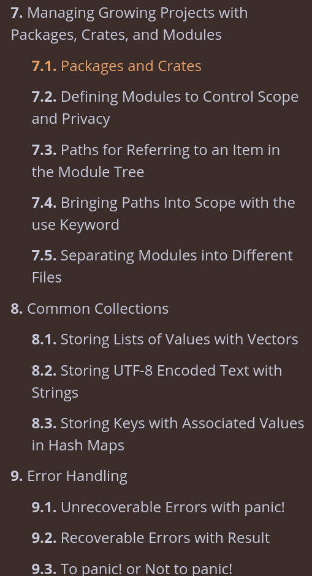

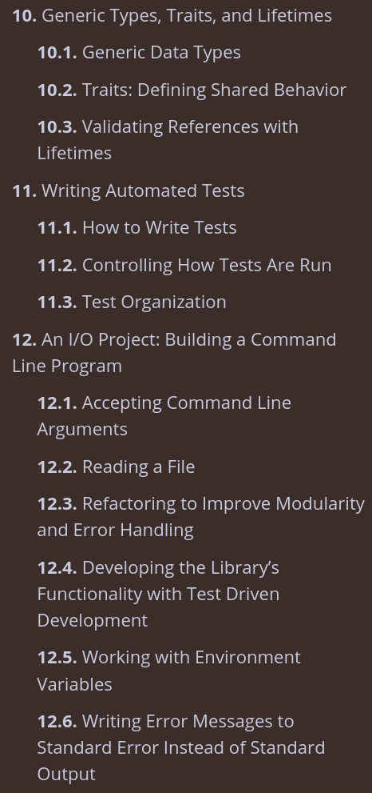

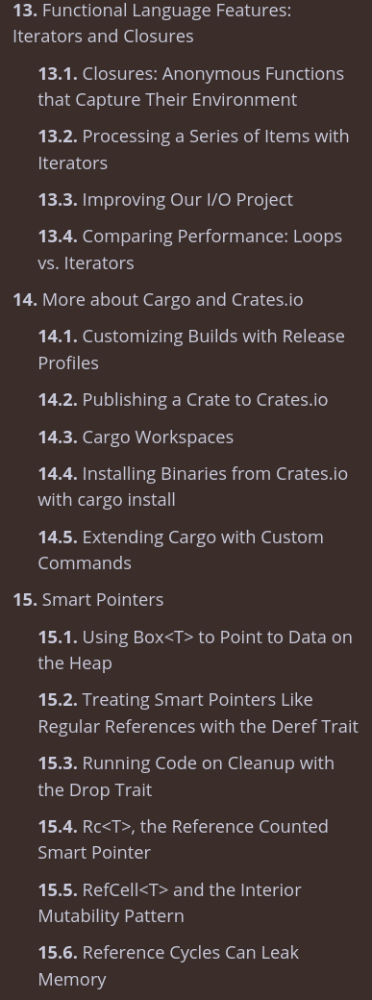

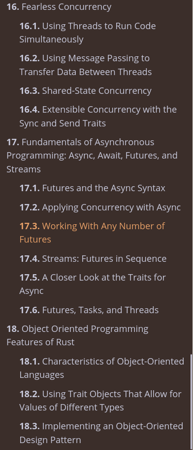

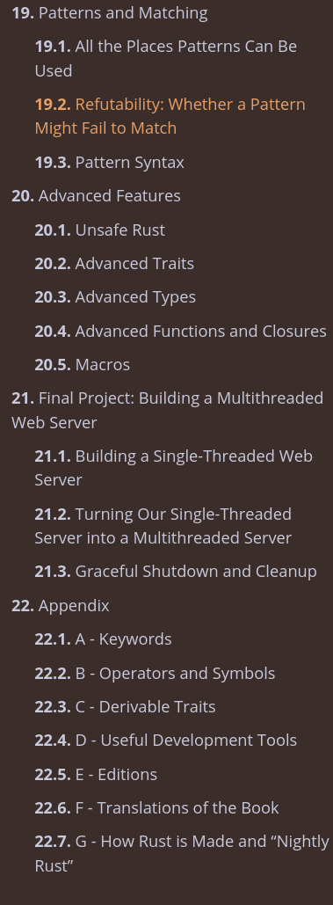

    Многопоточность и распараллеливание.

    async/await

    traits 
    
    Будущее Rust 

        Планы по улучшению языка (например, async closures, const generics).
        Расширение использования в разных областях (IoT, WebAssembly, AI).

# Ищу всех кто готов изучать Rust вместе!

https://t.me/s21_rust - я создал неофициальный канал школы по Rust. Разбил по тредам

> Читаем Rust Book, делимся материалами и вакансиями, решаем leetcode, делаем пет-проекты, организовываем групповые проекты для портфолио, мотивируем и формируем сообщество Rustaceans в Школе 21!

## Полезные ссылки

https://www.youtube.com/watch?v=5C_HPTJg5ek - Rust за 100 секунд с анимациями.

https://doc.rust-lang.org/book/ - Rust book

https://doc.rust-lang.org/cargo/ - Cargo book

https://t.me/rust_code - Новостной канал про новенькое и с полезными утилитами на Rust'е

https://t.me/rust_chats - чат новостного канала

https://t.me/rustlang_ru - основной русскоязычный чат, 5000 участников

https://t.me/rust_beginners_ru - чат для начинающих

https://t.me/rust_offtopic - оффтоп

https://t.me/ruRust_msk - митапы, встречи

https://t.me/books_englishhh - книги