- [Почему я выбрал Rust](#Почему-я-выбрал-Rust)
- [От отрицания сразу к принятию](#От-отрицания-сразу-к-принятию)
- [Установка Rust](#Установка-Rust)
- [Начало работы как я создал этот проект](#Начало-работы-как-я-создал-этот-проект)
- [Переменные и иммутабельность](#Переменные-и-иммутабельность)
- [Типы данных](#Типы-данных)
- [Функции](#Функции)
- [Циклы](#Циклы)
- [Работа с памятью ownership и borrowing](#Работа-с-памятью-ownership-и-borrowing)

# Почему я выбрал Rust

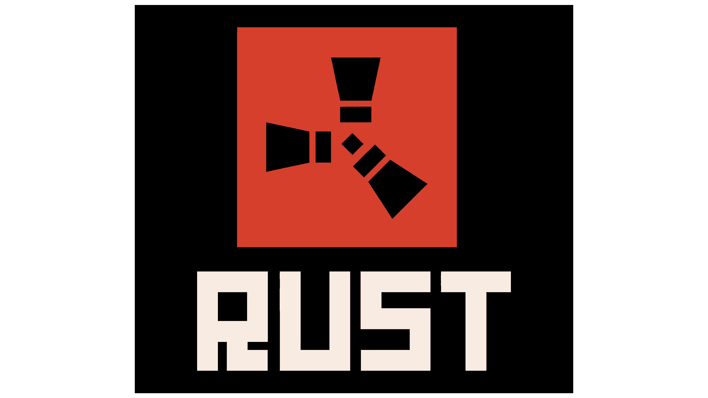

> рейтинг любимых языков программирования по опросу stackoverflow:

Опрос:
https://survey.stackoverflow.co/2024/technology#admired-and-desired


Что меня первично оттолкнуло:

> Излишняя любовь сообществом - подозрительно.

Складывается вопрос - почему так любят?

# От отрицания сразу к принятию

Проект начал своё начало в Mozilla у одного из сотрудников как хобби. Интерес в компании к проекту увеличился.

Сейчас разработкой занимается не Mozilla, Rust Foundation. Привлекаются инвестиции и разработки ведутся из разных компаний, одни из крупных: 

##### Cloudflare

Cloudflare открыла код Rust-фреймворка для программируемых сетевых сервисов — Pingora

https://habr.com/ru/articles/797015/ 

##### Dropbox

Использует Rust в своих продуктах

https://github.com/orgs/dropbox/repositories?q=rust

##### Microsoft:

Инвестиции: 

https://blobstreaming.org/microsofts-1m-vote-of-confidence-in-rusts-future/

Поиск работников для переписывания кода: 

https://devdigest.today/goto/2435

Репозиторий: 

https://github.com/orgs/microsoft/repositories?q=rust


##### Amazon

Инвестиции и совместная разработка проекта вместе с Rust Foundation над улучшением безопасности в Unsafe Mode:

(https://aws.amazon.com/blogs/opensource/verify-the-safety-of-the-rust-standard-library/)

##### Linux Foundation

Позиция Линуса Торвальдса по продвижению Rust в ядро.

https://www.opennet.ru/opennews/art.shtml?num=62764


> Производительность сопоставимая с C и C++ как решение проблем ЯП с Garbage Collector

Latency vs Throughput  

    Latency  — это время, необходимое для завершения одной операции.
    Throughput  — это количество операций, которые система может обработать за единицу времени.

Пример: 

    Если у вас низкая latency (быстрый отклик), но маленький throughput, система будет быстро отвечать на каждый запрос, но сможет обработать их ограниченное количество.
    Если у вас высокий throughput, но большая latency, система сможет обработать много запросов, но каждый из них будет выполняться медленнее.
     

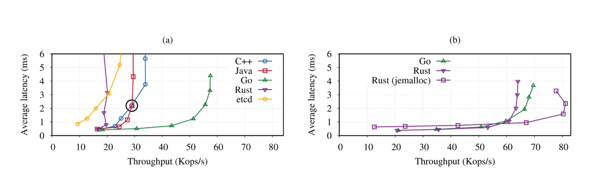


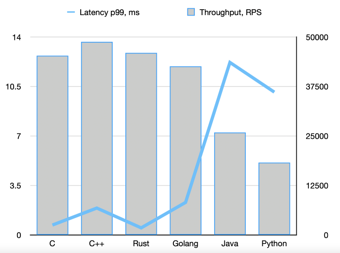

исследование:
https://arxiv.org/html/2405.11182v1
https://nuancesprog.ru/p/14464/

> Фокус на безопасности - как решение проблем C и C++

Иммутабельность переменных по умолчанию, новая парадигма работы с памятью: borrowing и ownership. Решение Race Condition, Memory leaks, dangling pointers, buffer overflows, double free memory.

# Установка Rust

Скачивал Rust на Arch официально рекомендуемым способом - через менеджер обновлений rustup.

(Гайд: https://wiki.archlinux.org/title/Rust_(%D0%A0%D1%83%D1%81%D1%81%D0%BA%D0%B8%D0%B9))

    Компилятор Rust (rustc) : 
        Основной компилятор Rust, который преобразует ваш код на Rust в машинный код.
         

    Cargo : 
        Система сборки и управление зависимостями для Rust-проектов.
        Позволяет создавать проекты, управлять зависимостями из crates.io, компилировать и запускать программы.
         

    Standard Library : 
        Стандартная библиотека Rust, которая предоставляет базовые типы данных, коллекции, потоки, I/O и другие функциональные возможности.
         

    Rust Source Code  (при необходимости): 
        Источники стандартной библиотеки Rust, которые могут быть полезны для отладки или расширения.
         

    Документация  (опционально): 
        Локальная копия документации Rust, включая The Book, API справочник и другие ресурсы.
         

    Дополнительные компоненты : 
        Например, RLS (Rust Language Server) для поддержки IDE, rust-analyzer, Clippy (анализатор кода), Miri (инструмент для проверки безопасности памяти) и другие инструменты.

### LLVM

Rust через rustup автоматически скачивает предварительно скомпилированную версию LLVM, которая используется для компиляции кода.

### Какие зависимости требуются для работы Rust? 

1. LLVM : 

    Rust использует LLVM как backend для генерации машинного кода.
     

2. C++ Standard Library : 

    Для некоторых платформ (например, Linux) требуется C++ стандартная библиотека (обычно libstdc++ или libc++), так как Rust использует её для некоторых низкоуровневых операций.
     

3. Системные зависимости : 

    На разных системах могут потребоваться дополнительные пакеты для успешной работы Rust. Например:
        Linux : build-essential, clang, cmake, pkg-config.
        macOS : Xcode Command Line Tools (xcode-select --install).
        Windows : MSVC или MinGW (в зависимости от выбранного компилятора).
         
     

4. Для некоторых задач могут потребоваться дополнительные инструменты : 

    Если вы работаете с FFI (Foreign Function Interface) или вызываете системные API, может потребоваться установка соответствующих заголовочных файлов и библиотек.
     

>Для дебаггинга В VScode потребуется CodeLLDB

### Обновление до новой версии Rust:

`rustup update`

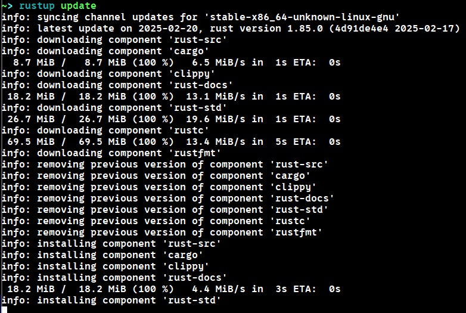

# Начало работы как я создал этот проект

Команда

`cargo new whyrust_250223`

Cоздаёт и инициализирует проект вместе с cargo.toml - конфигурационным файлом с зависимостями и описанием как менеджер cargo будет билдить и запускать проект.

    my_project/
    ├── Cargo.toml
    ├── src/
    │   └── main.rs
    └── .gitignore
         

Команда

`cargo init`

Инициализирует аналогичную схему в уже созданной директории

Но если директории не существует, то команды 

`cargo new <projectname>`

и

`cargo init <projectname>`

Будут аналогичны


Минимум ручной работы.

# Переменные и иммутабельность

По умолчанию в Расте переменные иммутабельны и чтобы сказать что переменная изменяется, нужно это указать явно

```Rust
fn main() {
    let mut x = 5;
    println!("The value of x is: {x}");
    x = 6;
    println!("The value of x is: {x}");
}
```

### Константы.

```Rust
const THREE_HOURS_IN_SECONDS: u32 = 60 * 60 * 3;
```

Внимание на нейминг.

Отличие иммутабельных переменных от контсант - константы определяются во врея компиляции и им не могут быть присвоены переменные (строго литералы или статические выражения), а переменные в результате выполнения.

### Shadowing (как я называю "затенение")

Посмотрим на любопытный код:

```Rust
fn main() {
    let x = 5;

    let x = x + 1;

    {
        let x = x * 2;
        println!("The value of x in the inner scope is: {x}");
    }

    println!("The value of x is: {x}");
}
```

Выведет:
```Shell
$ cargo run
   Compiling variables v0.1.0 (file:///projects/variables)
    Finished `dev` profile [unoptimized + debuginfo] target(s) in 0.31s
     Running `target/debug/variables`
The value of x in the inner scope is: 12
The value of x is: 6
```

Так можно

```Rust
    let spaces = "   ";
    let spaces = spaces.len();
```

А так нельзя:

```Rust
    let mut spaces = "   ";
    spaces = spaces.len();
```

```Shell
$ cargo run
   Compiling variables v0.1.0 (file:///projects/variables)
error[E0308]: mismatched types
 --> src/main.rs:3:14
  |
2 |     let mut spaces = "   ";
  |                      ----- expected due to this value
3 |     spaces = spaces.len();
  |              ^^^^^^^^^^^^ expected `&str`, found `usize`

For more information about this error, try `rustc --explain E0308`.
error: could not compile `variables` (bin "variables") due to 1 previous error
```

# Типы данных

Питоньи фокусы не прокатят

Такое не скомпилируется:

```Rust
let guess = "42".parse().expect("Not a number!");
```

```Shell
$ cargo build
   Compiling no_type_annotations v0.1.0 (file:///projects/no_type_annotations)
error[E0284]: type annotations needed
 --> src/main.rs:2:9
  |
2 |     let guess = "42".parse().expect("Not a number!");
  |         ^^^^^        ----- type must be known at this point
  |
  = note: cannot satisfy `<_ as FromStr>::Err == _`
help: consider giving `guess` an explicit type
  |
2 |     let guess: /* Type */ = "42".parse().expect("Not a number!");
  |              ++++++++++++

For more information about this error, try `rustc --explain E0284`.
error: could not compile `no_type_annotations` (bin "no_type_annotations") due to 1 previous error
```

Rust статически типизированный, ему надо понимать, что мы хотим записать в guess.

```Rust
let guess: u32 = "42".parse().expect("Not a number!");
```

*Кстати expect - это что то вроде исключений, что меня тоже зацепило лаконичностью или как в Go 

```Go
if err != nil {}
```

Но в Rust. То есть при выполнении функции 

`.parse()`

Она ожидает что мы будем делать на случай если что-то пойдёт не так

### Типы:


Arch - архитектура (x32 или x64 итд, хм, а может даже и x128)

Кстати, насчёт выхода за границы - если мы тестируем в режиме debug (по умолчанию при cargo run) то при выходе за границы диапазона - вылезет ошибка.

Если в режиме "--release", то он просто циклично посчитает с конца в начало (что-то вроде 127 + 2 = -126) 

Как это ловить в релизной версии сказано тут

https://doc.rust-lang.org/book/ch03-02-data-types.html#integer-overflow

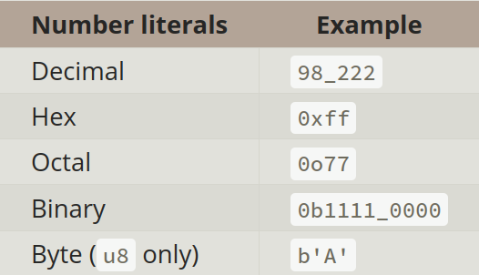

#### Float

Так же числа с плавающей точкой

f32, f64.

в соответствии с IEEE-754 standard.

Операции:

```Rust
fn main() {
    // addition
    let sum = 5 + 10;

    // subtraction
    let difference = 95.5 - 4.3;

    // multiplication
    let product = 4 * 30;

    // division
    let quotient = 56.7 / 32.2;
    let truncated = -5 / 3; // Results in -1

    // remainder
    let remainder = 43 % 5;
}
```

#### char

```Rust
fn main() {
    let c = 'z';
    let z: char = 'ℤ'; // with explicit type annotation
    let heart_eyed_cat = '😻';
}
```

По умолчанию char 4 байта.

Подробнее про строки:

https://doc.rust-lang.org/book/ch08-02-strings.html#storing-utf-8-encoded-text-with-strings

#### Tuple

```Rust
fn main() {
    let tup = (500, 6.4, 1);

    let (x, y, z) = tup;

    println!("The value of y is: {y}");
}
```

#### Array (не путать с векторами!)

>NOTE!

Размер Array определяется на этапе компиляции. И задать размер как переменную невозможно! Для этого созданы вектора, когда размер нам заранее неизвестен.!

```Rust
fn main() {
    let months = ["January", "February", "March", "April", "May", "June", "July",
              "August", "September", "October", "November", "December"];
    let first = a[0];
    let second = a[1];
}
```

```Rust
fn main() {
    let a: [i32; 5] = [1, 2, 3, 4, 5];
}
```

```Rust
fn main() {
    let a: [i32; 5] = [1, 2, 3, 4, 5];
}
```

Проинициализирует пять троек:

```Rust
fn main() {
    let a = [3; 5];
}
```

Выход за пределы массива в таком коде выдадут ошибку даже в режиме --release

```Rust
use std::io;

fn main() {
    let a: [i8; 5] = [1, 2, 3, 4, 5];

    println!("Please enter an array index.");

    let mut index = String::new();

    io::stdin()
        .read_line(&mut index)
        .expect("Failed to read line");

    let index: usize = index
        .trim()
        .parse()
        .expect("Index entered was not a number");

    let element = a[index] + 127;

    println!("The value of the element at index {index} is: {element}");
}
```

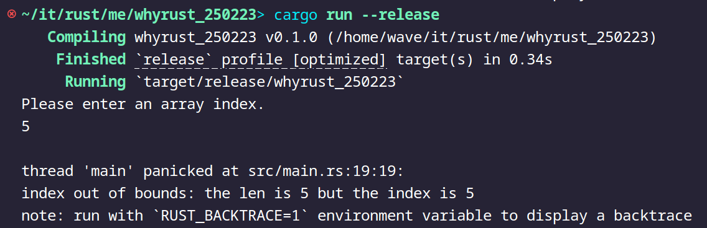

# Функции

```Rust
fn main() {
    another_function(5);
}

fn another_function(x: i32) {
    println!("The value of x is: {x}");
}
```
Прошу обратить внимание
snake_case.

## Statements and Expressions

внутри statement находится expression (выражение)
То есть выражение внутри. А statement как обёртка над выражением.

В то же время мы не может присвоить statement statement'у.

Не скомпилируется:

```Rust
fn main() {
    let x = let y = 6;
}
```

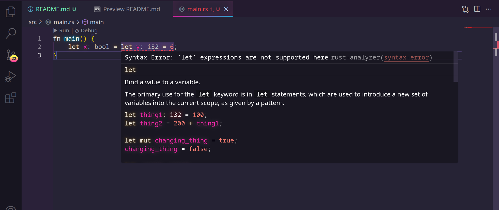

А такое скомпилируется, поскольку statement let y = ... закрылся выражением;, а не другим statement.

```Rust
fn main() {
    let y = {
        let x = 3;
        x + 1
    };

    println!("The value of y is: {y}");
}
```

## Return values

Скомпилируется, мы опускаем return:

Кстати внимание на сигнатуру возвращаемого значения.

```Rust
fn five() -> i32 {
    5
}

fn main() {
    let x = five();

    println!("The value of x is: {x}");
}
```

Прелесть!

А теперь внимание! Квиз!

Какой из этих двух скомпилируется, а какой нет?

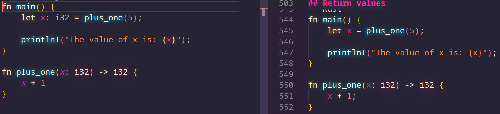

Number One

```Rust
fn main() {
    let x = plus_one(5);

    println!("The value of x is: {x}");
}

fn plus_one(x: i32) -> i32 {
    x + 1
}
```

Number Two

```Rust
fn main() {
    let x = plus_one(5);

    println!("The value of x is: {x}");
}

fn plus_one(x: i32) -> i32 {
    x + 1;
}
```

```Shell
$ cargo run
   Compiling functions v0.1.0 (file:///projects/functions)
error[E0308]: mismatched types
 --> src/main.rs:7:24
  |
7 | fn plus_one(x: i32) -> i32 {
  |    --------            ^^^ expected `i32`, found `()`
  |    |
  |    implicitly returns `()` as its body has no tail or `return` expression
8 |     x + 1;
  |          - help: remove this semicolon to return this value

For more information about this error, try `rustc --explain E0308`.
error: could not compile `functions` (bin "functions") due to 1 previous error
```

# Control flow if statements

Отвыкаем от излишней свободы в Си

Не скомпилируется. Поскольку ожидает ЯВНО bool.

```Rust
fn main() {
    let number = 3;

    if number {
        println!("number was three");
    }
}
```

```Shell
$ cargo run
   Compiling branches v0.1.0 (file:///projects/branches)
error[E0308]: mismatched types
 --> src/main.rs:4:8
  |
4 |     if number {
  |        ^^^^^^ expected `bool`, found integer

For more information about this error, try `rustc --explain E0308`.
error: could not compile `branches` (bin "branches") due to 1 previous error
```

```Rust
fn main() {
    let number = 3;

    if number {
        println!("number was three");
    }
}
```

*Не обращайте внимания на 

`0 != number`

*Это не рекомендации так писать в Rust, а лично мои. Мозгу проще воспринимать сначала литерал а потом то, с чем идёт сравнение, чем держать в памяти сначала абстрактный number а потом сравнивать с нулём. Это действует доли секунды, да, но немного помогает. 

```Rust
fn main() {
    let number = 3;

    if 0 != number {
        println!("number was three");
    }
}
```

#### else if

```Rust
fn main() {
    let number = 6;

    if number % 4 == 0 {
        println!("number is divisible by 4");
    } else if number % 3 == 0 {
        println!("number is divisible by 3");
    } else if number % 2 == 0 {
        println!("number is divisible by 2");
    } else {
        println!("number is not divisible by 4, 3, or 2");
    }
}
```

#### Вместо тернарного оператора

```Rust
fn main() {
    let condition = true;
    let number = if condition { 5 } else { 6 };

    println!("The value of number is: {number}");
}
```

Не скомпилируется

```Rust
fn main() {
    let condition = true;

    let number = if condition { 5 } else { "six" };

    println!("The value of number is: {number}");
}
```

```Shell
$ cargo run
   Compiling branches v0.1.0 (file:///projects/branches)
error[E0308]: `if` and `else` have incompatible types
 --> src/main.rs:4:44
  |
4 |     let number = if condition { 5 } else { "six" };
  |                                 -          ^^^^^ expected integer, found `&str`
  |                                 |
  |                                 expected because of this

For more information about this error, try `rustc --explain E0308`.
error: could not compile `branches` (bin "branches") due to 1 previous error
```

# Циклы

Тут уже ничего особенного, поэтому долго не задержимся

```Rust
fn main() {
    loop {
        println!("again!");
    }
}
```

*Мне больше по душе конечно цикл у Go - любой цикл можно через оператор for реализовать.

Тут видимо всё же хотят разграничить 

>loop - без условий, 

>while - с одним условием

>for - перебирает коллекции либо с тремя классическими

Можно и такие фокусы. break тут как return работает.

```Rust
fn main() {
    let mut counter = 0;

    let result = loop {
        counter += 1;

        if counter == 10 {
            break counter * 2;
        }
    };

    println!("The result is {result}");
}
```

## Labels (для break)

```Rust
#![allow(unreachable_code, unused_labels)]

fn main() {
    'outer: loop {
        println!("Entered the outer loop");

        'inner: loop {
            println!("Entered the inner loop");

            // This would break only the inner loop
            //break;

            // This breaks the outer loop
            break 'outer;
        }

        println!("This point will never be reached");
    }

    println!("Exited the outer loop");
}
```

## while

```Rust
fn main() {
    // A counter variable
    let mut n = 1;

    // Loop while `n` is less than 101
    while n < 101 {
        if n % 15 == 0 {
            println!("fizzbuzz");
        } else if n % 3 == 0 {
            println!("fizz");
        } else if n % 5 == 0 {
            println!("buzz");
        } else {
            println!("{}", n);
        }

        // Increment counter
        n += 1;
    }
}
```

## for

```Rust
fn main() {
    let a = [10, 20, 30, 40, 50];

    for element in a {
        println!("the value is: {element}");
    }
}
```

>rev() - значит reverse

```Rust
fn main() {
    for number in (1..4).rev() {
        println!("{number}!");
    }
    println!("LIFTOFF!!!");
}
```

если хотим итерироваться через кастомное значение, то используем 

`.step_by(2)`

```Rust
fn main() {
    for number in (1..4).rev().step_by(2) {
        println!("{number}!");
    }
    println!("LIFTOFF!!!");
}
```

```Rust
fn main() {
    // `n` will take the values: 1, 2, ..., 100 in each iteration
    for n in 1..=100 {
        if n % 15 == 0 {
            println!("fizzbuzz");
        } else if n % 3 == 0 {
            println!("fizz");
        } else if n % 5 == 0 {
            println!("buzz");
        } else {
            println!("{}", n);
        }
    }
}
```

>Немного забежали вперёд, тут из нового вектор из стрингов, итератор, синтаксический сахар: match, который убирает нагромождения из if else операторов.

```Rust
fn main() {
    let names = vec!["Bob", "Frank", "Ferris"];

    for name in names.iter() {
        match name {
            &"Ferris" => println!("There is a rustacean among us!"),
            // TODO ^ Try deleting the & and matching just "Ferris"
            _ => println!("Hello {}", name),
        }
    }
    
    println!("names: {:?}", names);
}
```

# Работа с памятью ownership и borrowing

>Вот мы и добрались до самого интересного, как Rust'у удалось решить проблему memory leaks (утечки памяти), dangling pointers (висячие указатели) без использования garbage collector (сборщик мусора), что позволяет быть равным по производительности C/C++, а где то даже и быстрее. Этот раздел я бы назвал важнейшим, ведь он и рассказывает о главных особенностях Rust...

Если в кратце - две концепции которые автоматизируют выделение/освобождение памяти как в C/C++ и не требуют для этого сборщик мусора в рантайме, который замедляет работу.

Если подробнее:

Правила владения

Сначала давайте рассмотрим правила владения:

    - У каждого значения в Rust есть владелец
    - В каждый момент времени может быть только один владелец
    - Когда владелец выходит из области действия, значение будет сброшено

Область действия (всё тоже самое что и в других ЯП):

Пример со строковым литералом, строго закодированном на этапе компиляции

```Rust
{                       // s is not valid here, it’s not yet declared
    let s = "hello";    // s is valid from this point forward
                        // do stuff with s but not mutating
}                       // this scope is now over, and s is no longer valid

```

Выделение string в куче. Если хотим менять

Память автоматически возвращается, как только переменная, которой она принадлежит, выходит из области видимости.

```Rust
{
    let s = String::from("hello");
    s.push_str(", world!"); // push_str() appends a literal to a String
    println!("{s}"); // This will print `hello, world!`
}
```

Когда она выходит из области видимости Rust вызывает деструктор drop автоматически.

https://doc.rust-lang.org/std/ops/trait.Drop.html#tymethod.drop

В C++ этот шаблон освобождения ресурсов в конце жизненного цикла элемента иногда называется Resource Acquisition Is Initialization (RAII)

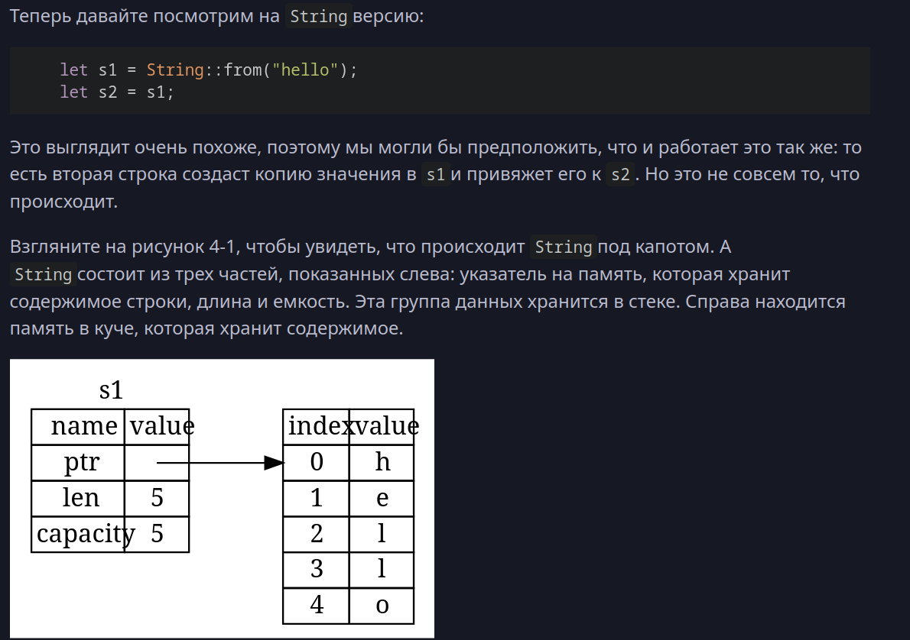

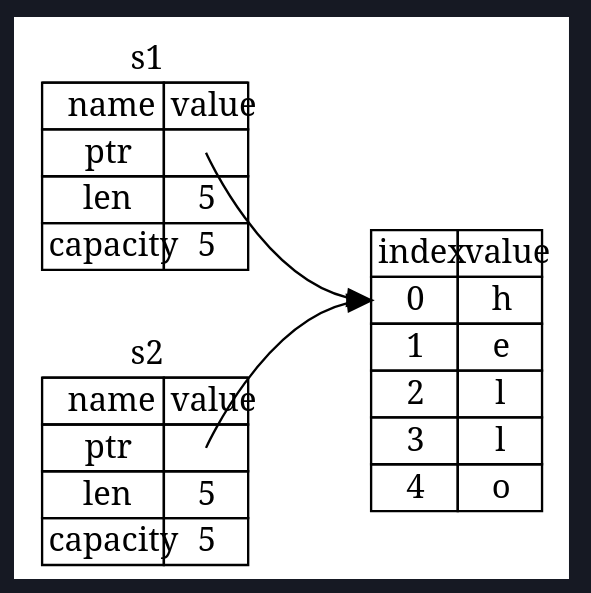

>Важно! Чтобы не было двойного освобождения, Rust сделает s1 недействительной! Это сделано, чтобы уйти от проблемы двойного освобождения. 

Не скомпилируется:

```Rust
fn main() {
    let s1 = String::from("hello");
    let s2 = s1;

    println!("{s1}, world!");
}
```

```Shell
$ cargo run
   Compiling ownership v0.1.0 (file:///projects/ownership)
error[E0382]: borrow of moved value: `s1`
 --> src/main.rs:5:15
  |
2 |     let s1 = String::from("hello");
  |         -- move occurs because `s1` has type `String`, which does not implement the `Copy` trait
3 |     let s2 = s1;
  |              -- value moved here
4 |
5 |     println!("{s1}, world!");
  |               ^^^^ value borrowed here after move
  |
  = note: this error originates in the macro `$crate::format_args_nl` which comes from the expansion of the macro `println` (in Nightly builds, run with -Z macro-backtrace for more info)
help: consider cloning the value if the performance cost is acceptable
  |
3 |     let s2 = s1.clone();
  |                ++++++++

For more information about this error, try `rustc --explain E0382`.
error: could not compile `ownership` (bin "ownership") due to 1 previous error
```


```Rust
fn main() {
    let names = vec!["Bob", "Frank", "Ferris"];

    for name in names.into_iter() {
        match name {
            "Ferris" => println!("There is a rustacean among us!"),
            _ => println!("Hello {}", name),
        }
    }
    
    println!("names: {:?}", names);
    // FIXME ^ Comment out this line
}
```

borrowing

```Rust
fn main() {
    let mut names = vec!["Bob", "Frank", "Ferris"];

    for name in names.iter_mut() {
        *name = match name {
            &mut "Ferris" => "There is a rustacean among us!",
            _ => "Hello",
        }
    }

    println!("names: {:?}", names);
}
```

TODO: прикрепить схемку как это работает.

# Синтаксический сахар, match, null и использование Option/Result.

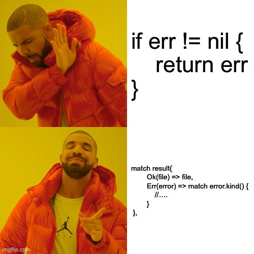

# Cargo

### Экосистема crates.io

### Сборка проекта из исходников на C и C++ если в кратце:


### Сборка проекта из исходников на Rust:


`cargo install --path "project_to_build" --locked`

Затем добавление в path через командную строку.


4. Интерактивные элементы:  

    Live-демонстрации :
        Напишите простой код на Rust и покажите его компиляцию и выполнение.
        Демонстрация работы cargo (например, создание проекта, добавление зависимости).
         

# Unsafe rust.

> Rust стремится быть безопасным и производительным языком. Его система типов и модель владения обеспечивают надежные гарантии безопасности; однако эта модель может быть слишком ограничительной (для эффективности, доступа к оборудованию, наследования и т. д.). Чтобы преодолеть это, Rust предоставляет механизм для выполнения небезопасных операций (Unsafe Rust), которые обходят гарантии компилятора.

(Это выжимка из статьи об инвестициях Амазон)

Зачем нужен unsafe Rust?

    Доступ к низкоуровневым деталям: 
        В Rust многие аспекты безопасности памяти обеспечиваются компилятором через систему владения (ownership) и заимствования (borrowing). Однако иногда нужно обойти эти ограничения для работы с низкоуровневыми деталями системы.
        Пример: работа с указателями на уровне железа или использование внешних библиотек, написанных на C/C++.
         

    Интерфейс с внешним кодом (FFI): 
        Для взаимодействия с кодом на других языках (например, C/C++) часто требуется использовать unsafe-операции, так как такие библиотеки могут не соответствовать правилам безопасности Rust.
        Пример: вызов функций из libc или других системных библиотек.
         

    Выполнение операций, которые невозможно выразить безопасно : 
        Некоторые операции, такие как создание циклических ссылок или работа с raw-указателями, невозможно безопасно выразить в Rust без использования unsafe.
         

    Оптимизация производительности : 
        В некоторых случаях использование unsafe-кода может дать возможность оптимизировать производительность, отказавшись от проверок безопасности, которые выполняет компилятор.
         
     

Какие задачи решает unsafe Rust?  
1. Работа с raw-указателями  

    В Rust есть два типа raw-указателей: *const T и *mut T. Они позволяют работать с памятью напрямую, минуя систему владения и заимствования.
    
    Пример:

```Rust
let mut num = 5;
let r1 = &num as *const i32; // Создание immutable raw-указателя
let r2 = &mut num as *mut i32; // Создание mutable raw-указателя

unsafe {
    println!("r1 is: {}", *r1); // Чтение значения через raw-указатель
    *r2 = 10; // Изменение значения через raw-указатель
}
```

2. Вызов extern-функций  

    Для вызова функций из внешних библиотек (например, libc) используется ключевое слово extern.
    
    Пример:

```Rust
extern "C" {
    fn abs(input: i32) -> i32;
}

fn main() {
    unsafe {
        println!("Absolute value of -3 is: {}", abs(-3));
    }
}
```

# Продукты на rust

# Rust в DevOps

# Type assertion

# Конфликт разработки драйверов на rust

<!-- # Примеры реальных проблем, которые решает Rust : 

    Race conditions.
    Memory leaks.
    dangling pointers.
    buffer overflows. -->

# Комьюнити, документация, экосистема : 

    Активное сообщество.
    Регулярные релизы (каждые 6 недель).
    Хорошая документация и учебные материалы.

О чём можно рассказать потом:

    Многопоточность и распараллеливание.

    async/await

    traits 
    
    Будущее Rust 

        Планы по улучшению языка (например, async closures, const generics).
        Расширение использования в разных областях (IoT, WebAssembly, AI).

# Ищу всех кто готов изучать Rust вместе!

https://t.me/s21_rust - 

> Читаем Rust Book, делимся материалами и вакансиями, решаем leetcode, делаем пет-проекты, организовываем групповые проекты для портфолио, мотивируем и формируем сообщество Rustaceans в Школе 21!

## Полезные ссылки

https://doc.rust-lang.org/book/ - Rust book

https://doc.rust-lang.org/cargo/ - Cargo book

https://t.me/rust_code - Новостной канал про новенькое и с полезными утилитами на Rust'е

https://t.me/rust_chats - чат новостного канала

https://t.me/rustlang_ru - основной русскоязычный чат, 5000 участников

https://t.me/rust_beginners_ru - чат для начинающих

https://t.me/rust_offtopic - оффтоп

https://t.me/ruRust_msk - митапы, встречи

https://t.me/books_englishhh - книги